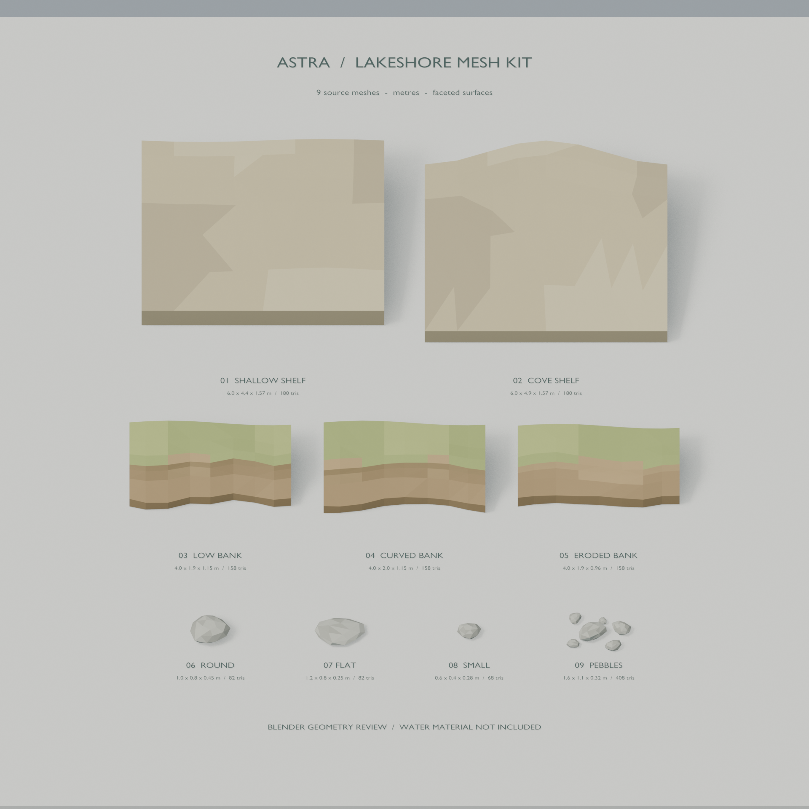
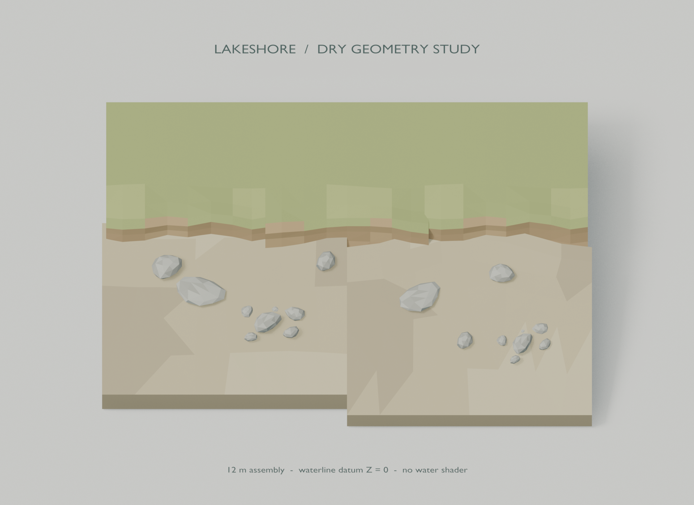

# 호숫가 메시 키트

분홍 지붕 집 레퍼런스의 얕은 바닥·흙 턱·수중 돌을 준비한 독립 Blender 자산이다. 수면 재질 및 원본 레벨과 별개로 제작했다. Blender 메시/FBX 단계이며 Unreal 임포트·레벨 배치·수면 반사 검증은 아직 하지 않았다.

아래는 **Blender에서 렌더한 메시 검토 화면**이다. Unreal 게임 화면이나 완성된 물 표현이 아니다.





## 구성

| 메시 | 용도 | 삼각형 |
|---|---|---:|
| SM_ShallowShelf_01 | 길이 6m, 수중 폭 4m의 완만한 모래 바닥 | 180 |
| SM_ShallowShelf_Cove_01 | 길이 6m, 수중 폭 4.5m의 오목한 만 바닥 | 180 |
| SM_ShoreBank_Straight_01 | 길이 4m의 낮은 풀·흙 턱 | 158 |
| SM_ShoreBank_Curve_01 | 길이 4m의 오목한 해안 턱 | 158 |
| SM_ShoreBank_Low_01 | 길이 4m의 더 낮고 완만한 침식형 턱 | 158 |
| SM_SubmergedRock_Round_01 | 약 1.0×0.8×0.45m의 둥근 돌 | 82 |
| SM_SubmergedRock_Flat_01 | 약 1.25×0.8×0.25m의 납작한 돌 | 82 |
| SM_SubmergedRock_Small_01 | 약 0.6×0.45×0.28m의 작은 돌 | 68 |
| SM_SubmergedPebbles_01 | 약 1.6×1.1×0.32m, 자갈 6개 묶음 | 408 |

총 9종, 1,474삼각형. 상세 실제 bounds와 재질 슬롯은 [자산 명세](../../Layout/shoreline_assets.json)에 기록된다. 선반·제방 높이에는 지형에 묻을 하부가 포함되므로 전체 bounds를 노출 높이로 해석하지 않는다.

## 원본과 재생성

- [Blender 원본](../../Blender/AstraShorelineKit.blend): 편집 가능한 메시 라이브러리, 개별 전시, 조립 예시 및 카메라 포함.
- [통합 생성 스크립트](../../../Scripts/build_shoreline_kit.py): 팔레트, 검증, FBX, JSON, 프리뷰 생성.
- 모델별 모듈: [선반](../../../Scripts/shoreline_shelf.py), [흙 턱](../../../Scripts/shoreline_bank.py), [돌](../../../Scripts/shoreline_rocks.py).
- [FBX 재가져오기 검증](../../../Scripts/validate_shoreline_fbx.py).

프로젝트 폴더에서 PowerShell로 실행한다. Blender는 백그라운드 세션을 사용한다.

```powershell
& 'C:\Program Files\Blender Foundation\Blender 4.5\blender.exe' -b --factory-startup --python-exit-code 1 --python Scripts/build_shoreline_kit.py
& 'C:\Program Files\Blender Foundation\Blender 4.5\blender.exe' -b --factory-startup --python-exit-code 1 --python Scripts/validate_shoreline_fbx.py
```

첫 명령에 `-- --skip-render`를 붙이면 이미지 생성을 생략한다. 생성 스크립트는 이 키트의 출력만 갱신한다. 수동 수정한 원본은 다른 파일명으로 저장한 뒤 재생성한다. 기존 `AstraWoodland.blend`, `woodland_layout.json`, Landscape 높이맵과 Unreal 맵은 이 스크립트의 입출력 대상이 아니다.

## 단위와 배치 기준

- Blender 단위는 미터, 변환은 회전 0·스케일 1이다. 기존 프로젝트와 같은 FBX 단위 메타데이터 방식을 사용한다. UE 임포트 시 Convert Scene/Convert Scene Unit을 사용하고 추가 100배 배율을 넣지 않는다. 첫 선반의 길이 600cm를 임포트 검증 기준으로 삼는다.
- 선반·제방의 피벗은 해안 중앙, 로컬 수면 높이는 Z=0이다. 해안은 X를 따라가고 육지는 +Y, 호수는 -Y다. 기존 호수의 수면 +10cm에 맞출 때 기준 Z에 +10cm를 더한다.
- 돌 피벗은 바닥 접촉점, XY 중앙이다. 해저면에 약 2~5cm 묻고, 회전·크기를 달리한다. 색에 물의 청록색을 미리 굽지 않았다.
- 선반은 Landscape 위에 놓는 국부 바닥 덮개다. 먼 수중 끝과 옆면, 제방 양끝·뒤쪽은 Landscape에 묻히도록 배치하고 필요하면 지형 높이를 조정한다. 전체 지형을 대신하지 않는다.
- 제방들은 길이가 같아도 끝 단면이 완전히 일치하는 타일이 아니다. 10~30cm 정도 겹치거나 이음부를 지형·돌로 가리고 실제 각도에서 확인한다. Low 타입과 높은 타입의 접합은 별도 높이 전이가 필요하다.
- UVMap은 투영 UV다. 셰이더용 타일링 텍스처에는 쓸 수 있지만 고유 베이크용/라이트맵용 비중첩 UV는 아니다. 현재 동적 조명 프로젝트를 기준으로 준비했다.
- `ShoreData`는 선반/제방의 POINT 색상 속성이다. R=`clamp(-localZ/1.5)`, G=`clamp(-localY/4)`, B=0, A=1. 돌 RGB는 0이다. 곡선의 정확한 해안 거리·월드 수심·거품 마스크를 의미하지 않는다.
- FBX에서 정점 색상은 선형 데이터로 보존한다. UE FBX 임포트는 Vertex Color Import Option=Replace로 설정한다.
- 자산 기본 충돌 의도는 `none`. 보행 경계는 기존 Landscape/게임 충돌을 따른다. 제방을 실제 보행면으로 쓸 때만 별도 충돌을 확정한다.

## 조립 예시와 통합 범위

[shoreline_demo_layout.json](../../Layout/shoreline_demo_layout.json)은 원점 부근의 독립 12m 조립 예시다. 실제 집 앞 좌표가 아니다. 실제 맵에 그대로 합치지 않는다. 단위 및 Blender X,Y,Z → UE X,-Y,Z 변환은 기존 레이아웃 JSON과 같다.

Blender 컬렉션:

1. `01_ShorelineMeshLibrary`: 원점의 9종 원본. 전시와 겹치지 않도록 뷰포트·렌더에서 숨겨 둔다. 원본을 직접 편집할 때 표시한다.
2. `02_ShorelineDryStudy`: 물 없는 조립 예시. 기본 숨김이며 검토 시 Gallery를 숨기고 이 컬렉션과 Camera_DryShoreStudy를 사용한다.
3. `03_ShorelineAssetGallery`: 기본 전시 화면.
4. `04_PreviewOnly_CamerasLights`: 58도 직교 검토 카메라와 50도 Source Angle 조명.

`PreviewOnly_` 물체와 라벨은 모델링 검토용으로 FBX 자산/배치 명세에서 제외했다. 원본 게임의 물 재질·하늘·집·우물 작업과 통합할 때는 새 `/Game/Astra/Meshes/Shoreline` 경로에 임포트하고 재질 팔레트를 명세에 맞춰 연결한다.

## 검증

Blender 4.5.12 LTS에서 실제 생성·렌더·FBX 재가져오기를 실행했다.

- [메시 검사](../../Previews/Shoreline_MeshValidation.json): 닫힌 topology, 양의 체적, 퇴화 면/UV 없음, UV·정점 색상·변환.
- [FBX 검사](../../Previews/Shoreline_FBXValidation.json): 새 세션 재임포트 후 크기/축/피벗 bounds, 삼각형 수, 재질 슬롯, UV, 색상 속성, 이음 정점 병합 후 topology 보존.
- 시각 검토: 개별 모델의 실루엣·면 방향과 조립 예시에서 돌의 접지 확인.

남은 통합 검증은 UE 임포트 크기·축 확인, 실제 호숫가 배치와 지형 연결, 수면 투과 상태의 색감·가독성 및 최종 충돌이다.
