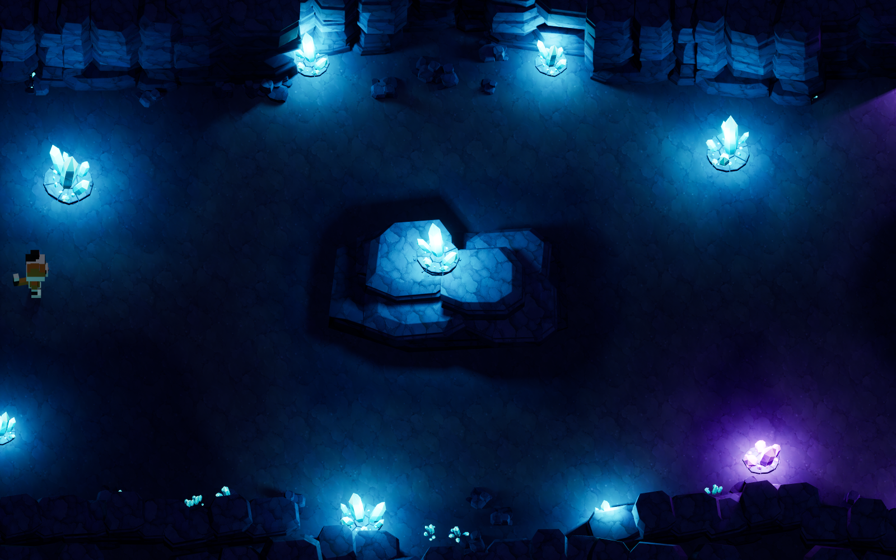
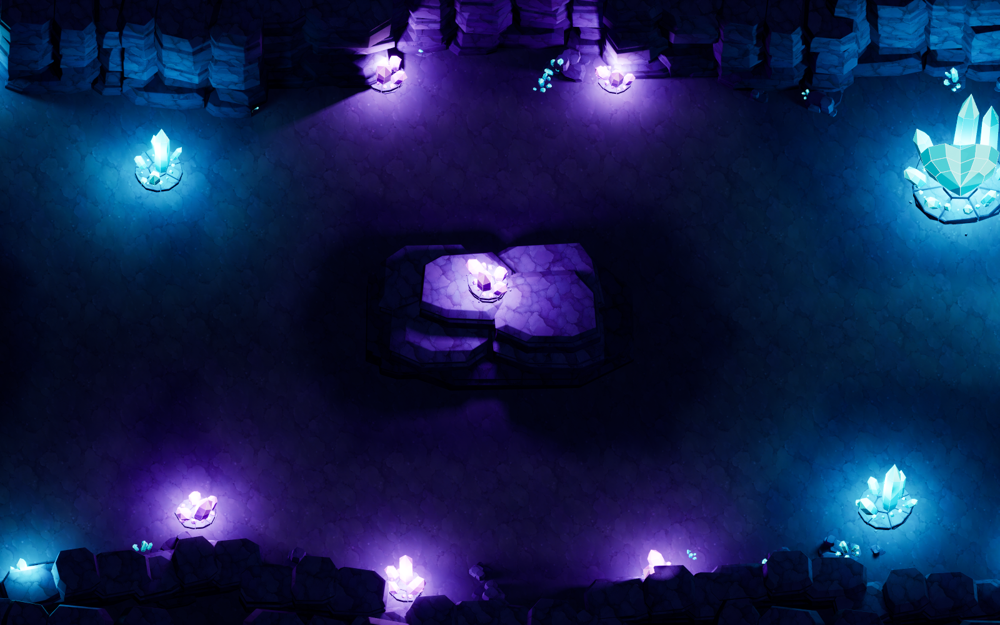
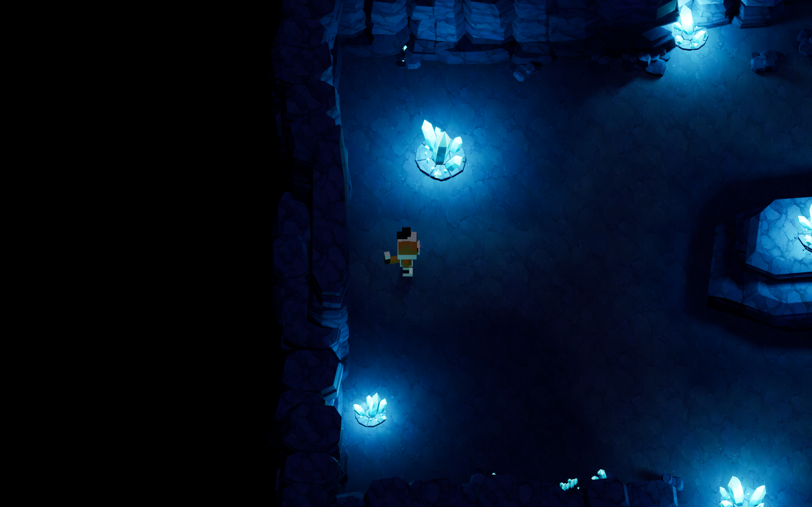
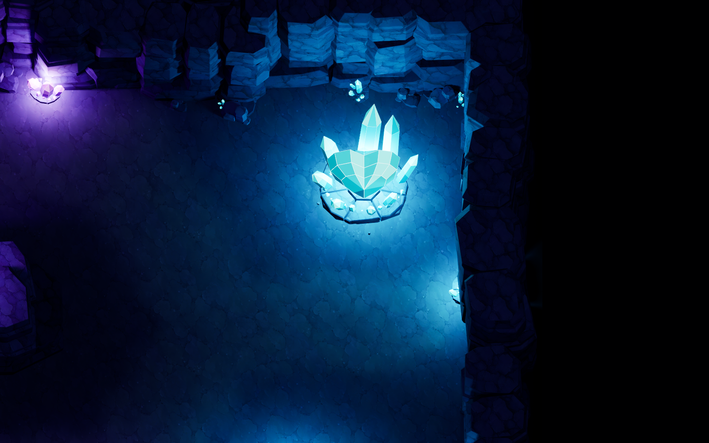
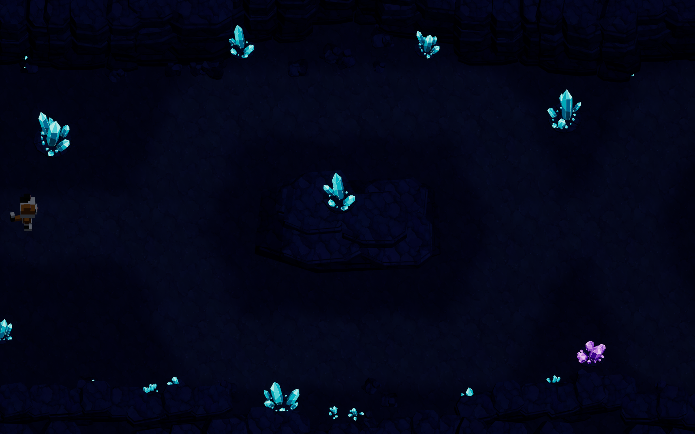

# 발광석 동굴 — Astra Crystal Cave

약 50×30m 동굴 내부를 삼색 고양이로 탐색한다. 청록색 발광석의 첫 갈림길, 보랏빛 발광석의 두 번째 갈림길, 큰 중심석이 있는 끝방이 이어진다.

- 맵: `/Game/Astra/Maps/L_AstraCrystalCave`
- 새 자산: `/Game/Astra/CrystalCave`
- 게임 모드: `/Script/AstraLevelTest.AstraCrystalCaveGameMode`
- WASD 이동, 마우스 조작 및 카메라 회전 없음. 고정 58도 직교 카메라가 고양이를 추적하며 폭은 23m다.
- 동굴에서는 숲의 장소를 대상으로 하는 P 데모를 연결하지 않는다.

## 제작 구조

전체 예상 화면을 먼저 ImageGen으로 만들고 암벽·발광석의 별도 모델링 시트와 암벽·바닥 텍스처를 생성했다. 원본 PNG와 프롬프트 JSON은 `ArtSource/Reference/CrystalCave` 및 `ArtSource/Textures/CrystalCave`에 보존한다. 생성 이미지는 목표 레퍼런스이며 실제 UE 결과가 아니다.

Blender에서 암벽 8종과 발광석 4종을 만들고 전체 공간을 조립했다. 벽 3종, 낮은 벽, 갈림길 암반 섬 2종, 잔해, 입구 포털과 청록·보라·중심석·작은 결정 군집으로 구성된다. 개별 FBX의 UV·노멀·크기·닫힌 메시 검증 결과는 각 키트 JSON에 들어 있다.

바닥은 실제 Landscape 2×1 컴포넌트다. 높이 샘플은 127×64, UE X축 폭 3000cm, Y축 길이 5000cm다. 완만한 요철의 소스 지형을 Blender에 보존하고 R16으로 추출했다. Blender `(x,y,z)` m를 UE `(x,-y,z)×100` cm로 변환한다. 전경 벽은 낮게 잘라 후방 통로를 가리지 않으며, 천정은 이동 구간 바깥의 입구 보에만 남긴다.

전체 배치는 메시 160개, 실제 광원 18개다. 장식 돌층이 계단처럼 작동하지 않도록 섬과 외곽 내부에 충돌 전용 상자 42개를 넣었다. 이 상자도 Blender Empty와 배치 JSON에 보존한다. 포털 뒤에는 지형 밖으로 빠지는 것을 막는 낮은 암벽 문턱이 있다. 최종 저장 맵은 카메라·Landscape 등을 포함해 229개 액터다.

발광석에는 발광 머터리얼과 18개의 이동 가능한 Point Light를 함께 사용한다. 주변 암벽은 직접 조명과 그림자를 받는다. 밝은 결정을 불투명 차폐물로 취급해 내부 광원을 가리는 문제를 피하기 위해 결정 메시의 그림자는 끈다. 50도 광원각의 아주 약한 방향광이 암부 실루엣을 보조하고, 노출은 수동 고정이다. 바닥의 조용한 생성 텍스처 위에 보행 경로의 밝기 변화를 넣는다.

## 원본과 재실행

| 자료 | 경로 |
| --- | --- |
| 전체/개별 레퍼런스·프롬프트 | `ArtSource/Reference/CrystalCave` |
| 생성 텍스처 | `ArtSource/Textures/CrystalCave` |
| 암벽 원본 | `ArtSource/Blender/CrystalCaveRocks.blend` |
| 결정 원본 | `ArtSource/Blender/CrystalCaveCrystals.blend` |
| 전체 배치 원본 | `ArtSource/Blender/AstraCrystalCave.blend` |
| FBX 12종 | `ArtSource/Meshes/CrystalCave` |
| 배치·광원·높이맵·동선 | `ArtSource/Layout/CrystalCave` |
| 실제 Blender 검토 렌더 | `ArtSource/Previews/CrystalCave/Blender_*.png` |
| 실제 UE 검증 | `ArtSource/Previews/CrystalCave/UE_*.png` 및 JSON |

1. Blender 4.5 CLI에서 `build_cave_rocks.py`, `build_cave_crystals.py`를 각각 실행한다. `--factory-startup -b --threads 4 --python <스크립트>`를 사용한다.
2. 같은 방식으로 `build_cave_scene.py`를 실행해 전체 `.blend`, 배치 JSON, R16 및 경로 명세를 생성한다.
3. 이 작업 사본의 `AstraLevelTestEditor Win64 Development`를 빌드한다. 격리 환경에서는 `-NoUBA -MaxParallelActions=4 -Log=<프로젝트>/Saved/CaveBuild.log`를 사용한다.
4. PowerShell에서 `Scripts/run_cave.ps1 -Mode Import` 실행. 전체 UE 에디터에서 동굴 전용 자산과 맵만 생성한다.
5. `Scripts/run_cave.ps1 -Mode Open`으로 동굴을 열고 Play한다.

`run_cave.ps1`은 캐시 위치도 이 작업 사본의 `DerivedDataCache`로 분리한다. 원본 프로젝트의 에디터·DLL을 덮거나 종료하지 않는다. Import는 생성한 동굴 맵을 재작성하므로 수동 편집을 보존하려면 다른 이름으로 복제한다.

검증 실행은 1600×1000 네이티브 해상도를 강제한다. 실행 인자에서만 NGX를 꺼 독립 에디터 종료 지연을 피한다. 기존 DLSS 플러그인·프로젝트 설정은 보존한다. `-Mode Relight`는 최종 광량·중심석 방향·충돌 경계를 적용한 뒤 저장된 상태를 검사한다. 전체 Import에도 같은 최종 설정이 반영되어 있다.

## 검증 절차

- `run_cave.ps1 -Mode Review -View CaveOverview`: 전체 실제 UE 화면.
- `-View CaveFork1`, `CaveFork2`, `CaveHeart`, `CaveGameplay`: 각 구역과 플레이 카메라.
- `-View CaveFork1 -LightsOff`: 같은 시점에서 18개 Point Light만 끄고 비교한다. 발광 머터리얼은 유지한다.
- `run_cave.ps1 -Mode Movement`: `-AstraCaveTest`를 실행한다. 실제 W/A/S/D 입력 이벤트를 기존 컨트롤러에 주입한다.

통행 검사는 입구부터 끝방까지 연속 이동, 두 갈림길의 양쪽 총 4개 경로, 두 암반 섬과 전경 벽의 충돌을 검사한다. 각 독립 경로의 시작점에만 위치를 설정하고 도중에는 순간이동하지 않는다. 접지·고정 카메라·경계 유지·연속 이동을 검사하며 0.2초 간격 경로 표본을 JSON에 남긴다. 모든 필수 경로와 검사가 통과하고 보고서 저장까지 성공해야 실행 코드 0으로 종료한다.

## 실제 검증 결과

UE 5.7.4 에디터 빌드와 저장 맵 검사를 통과했다. `UE_CaveSavedValidation.json`이 최종 저장 상태이며, `UE_CaveImport.json`은 초기 가져오기 단계 기록이다. 기존 Content·Config·Source 파일의 변경 없이 동굴 전용 파일을 추가했다.

실제 WASD 검사는 9/9 경로, 실패 0개로 통과했다. 입구→첫 갈림길→두 번째 갈림길→끝방을 연속으로 걸었으며, 각 갈림길의 양쪽 경로도 따로 통과했다. 바위섬 두 곳과 전경 벽·입구 문턱은 입력을 유지해도 경계에서 정지했다. 검사 결과를 JSON에 저장한 뒤 실제 프로세스 종료 코드 0을 확인했다.

| 첫 번째 갈림길 | 두 번째 갈림길 |
| --- | --- |
|  |  |

| 실제 플레이 카메라 | 끝방의 중심석 |
| --- | --- |
|  |  |

광원 비교는 같은 카메라·노출에서 Point Light 18개만 끄며 발광 머터리얼은 유지한다. 바닥과 바위 표면의 실제 픽셀 차이는 `verify_cave_results.py`와 `UE_CaveFinalValidation.json`에 기록한다. 실제 엔진 렌더는 모두 `UE_` 접두사로, Blender 검토와 생성 참고 이미지는 별도로 보존한다.

최종 비교 통과: 첫 갈림길 전경 바닥 표본의 화면 명도는 광원 OFF 0.0290 → ON 0.0998, 암반 앞면은 0.0204 → 0.1095였다. 발광 결정 자체를 제외한 같은 표면 영역을 비교했다. 이는 화면 RGB 기반 비교이며 물리적 조도 측정은 아니다. 6장 모두 실제 UE 1600×1000 렌더이며, 머터리얼·셰이더 컴파일 오류는 없었다.

| 실제 광원 ON | 실제 광원 OFF, 발광 재질 유지 |
| --- | --- |
|  |  |
