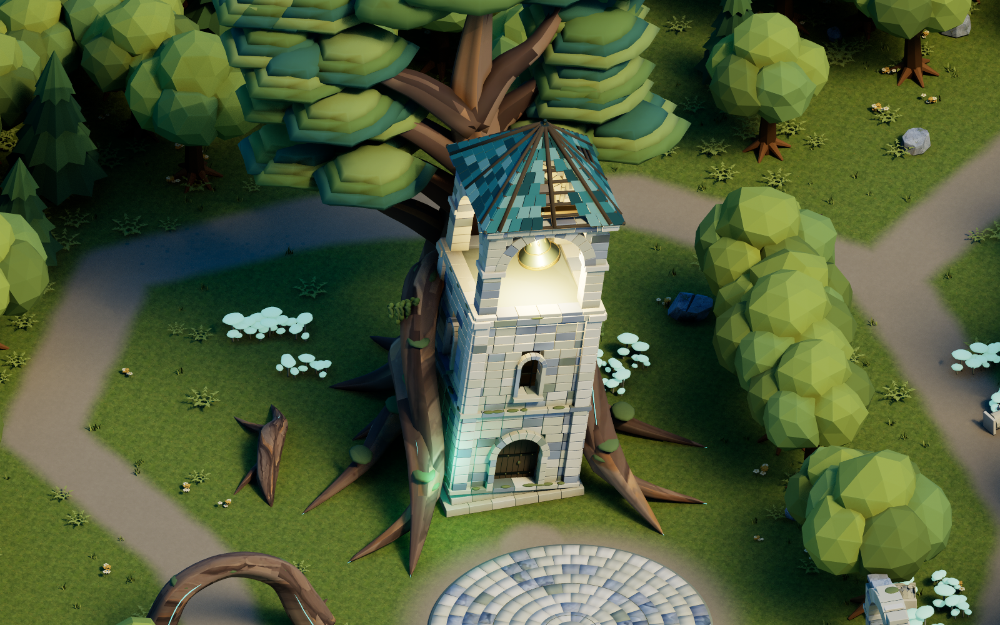
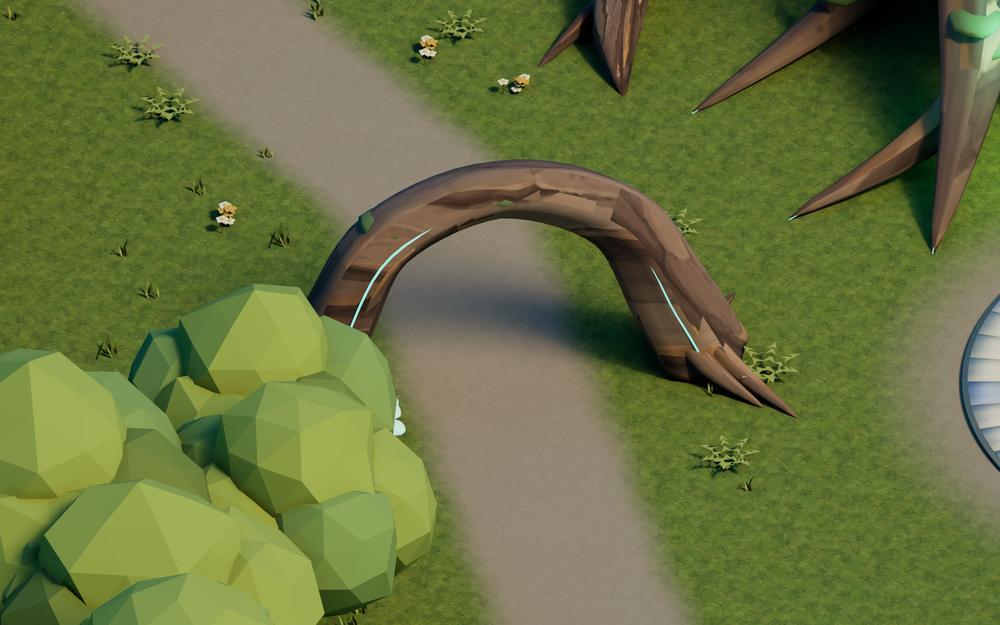
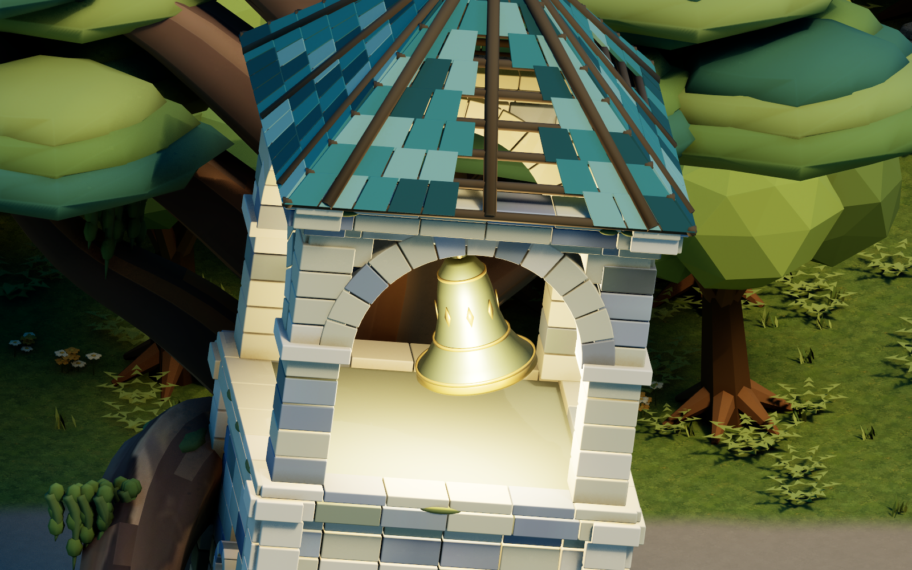
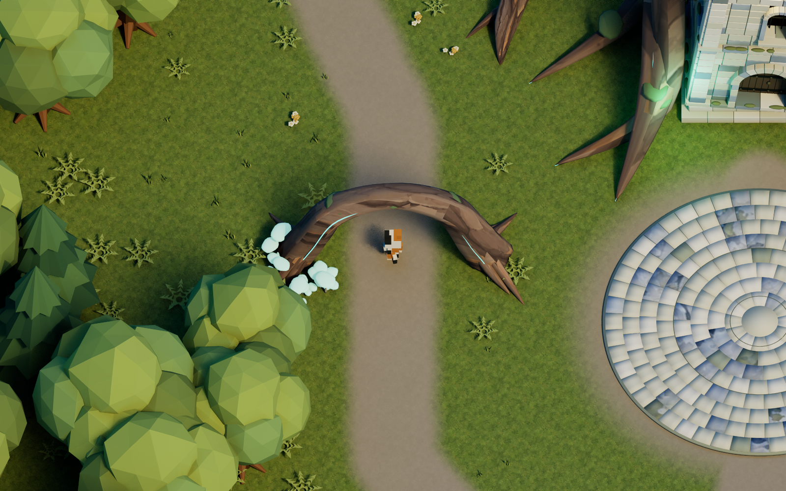

# 뿌리가 붙잡은 종탑

숲속의 기울어진 종탑을 거목의 뿌리가 감싸 지탱하는 독립 레벨이다. 약 18m 높이의 석조 종탑, 열린 종루의 청동 종, 깨진 청록 지붕과 원형 안뜰을 중심으로 뿌리 아래 통로·무너진 회랑·발광 버섯 정원이 이어진다.

## 실행과 반응

`/Game/Astra/Maps/L_AstraRootBelltower`를 열고 Play하거나 PowerShell에서 `Scripts/play_rootbelltower.ps1`을 실행한다. UE 5.7.4 에디터용 프로젝트이며 소스를 받은 환경에서는 에디터 모듈을 먼저 빌드한다.

- WASD: 기존 직립 삼색 고양이 이동. 마우스 조작 없이 고정된 탑다운 각도로 따라간다.
- P: 입구 → 안뜰 → 뿌리 아치 → 거목 뒤편 → 폐허 정원 → 회랑 → 돌아오는 길의 7개 자동 산책 컷. 다시 P를 누르면 이전 플레이 상태로 돌아온다.
- 원형 안뜰 중앙으로 다가가면 종소리가 한 번 울리고 뿌리의 청록색 빛과 종의 흔들림이 커진다. 멀어지면 잦아든다. 재진입 소리는 최소 8초 간격이다.
- 종은 상단 매달림 원점을 기준으로 약 ±1.25°~4.25° 흔들린다. 종소리는 외부 음원 없이 합성한 5초 청동 종 음색이다. 소리 감쇠는 고양이 위치를 기준으로 계산한다.

## 공간과 자산

실제 Landscape는 100.8×100.8m, 높이 샘플 127×127, 간격 80cm다. 새 메시 11종과 기존 숲 메시 15종을 사용했다. 정적 메시 액터 355개, native Foliage 3,784개(발광 버섯 50, 고사리 1,674, 풀 1,757, 꽃 303)와 나무 몸통 충돌을 포함해 저장 액터는 681개다.

| 새 모델 | 용도 |
| --- | --- |
| SM_RB_Tower / SM_RB_Bell | 7° 기울어진 석탑과 독립적으로 움직이는 종 |
| SM_RB_AncientTree / SM_RB_GrippingRoots | 종탑 뒤 거목과 탑을 감싸는 굵은 뿌리 |
| SM_RB_RootArch | 실제 통과 가능한 뿌리 아치 |
| SM_RB_CloisterArch / SM_RB_Courtyard | 무너진 회랑과 지름 12m 돌 안뜰 |
| SM_RB_FallenCapital / SM_RB_CrawlingRoot | 깨진 기둥머리와 지면 뿌리 |
| SM_RB_GlowMushrooms / SM_RB_MossPendant | 청록 발광 버섯과 늘어진 이끼 |

Directional Light는 이 맵에서만 3.5, Source Angle 50°, Sky Light 0.75다. 얕은 높이 안개와 뿌리·종루의 국소 조명 두 개를 사용한다. 기존 숲·별내림·연못·동굴 맵과 공유 자산은 별도 파일 해시로 보존 여부를 확인한다.

## 원본과 재생성

- 전체·건축·뿌리 생성 레퍼런스와 프롬프트: `ArtSource/Reference/RootBelltower/`. 생성 참고 이미지와 실제 UE 캡처를 구분해서 저장했다.
- 생성 나무껍질 텍스처: `ArtSource/Textures/RootBelltower/T_RB_AncientBark.png`.
- Blender 원본: `ArtSource/Blender/RootBelltowerArchitecture.blend`, `RootBelltowerRoots.blend`, 전체 배치 `AstraRootBelltower.blend`.
- 개별 FBX: `ArtSource/Meshes/RootBelltower/`. 전체 위치·회전·크기: `ArtSource/Layout/rootbelltower_layout.json`. R16 높이맵과 지형 셰이더도 같은 폴더에 있다.
- 원본 음원·합성 명세: `ArtSource/Audio/RootBelltower/`.
- 게임 반응 코드: `Source/AstraLevelTest/AstraRootBelltower.h/.cpp`.

메모리 부담을 줄이기 위해 아래 단계는 순서대로 실행하고, Blender·빌드·UE 에디터를 동시에 실행하지 않는다. Blender 4.5에서 `--background --threads 4 --python Scripts/<script>`로 건축 `build_rootbelltower_architecture.py` → 뿌리 `build_rootbelltower_roots.py` → 전체 배치 `build_rootbelltower_scene.py`를 실행한다. 각 스크립트는 프로젝트 위치를 자신의 경로에서 찾는다. 일반 Python으로 `build_rootbelltower_chime.py`를 실행해 종소리를 만든다.

UE 에디터 모듈을 빌드한 뒤, 에디터 Python으로 `import_rootbelltower_level.py`를 실행한다. 커맨드라인의 `-ExecutePythonScript=<절대 경로>`와 `-RenderOffscreen -unattended -NoLiveCoding`을 사용할 수 있다. Landscape 생성을 위해 실제 렌더러를 사용하며 `-NullRHI`는 사용하지 않는다. 기존 맵을 템플릿으로 복제하고 종탑 전용 폴더와 새 맵만 저장한다. 기존 메시를 그대로 두고 전체 배치만 재적용하려면 `-AstraRootBelltowerPlacementOnly`를 함께 전달한다.

## 검증 재실행

`Scripts/validate_rootbelltower_all.ps1`은 새 에디터에서 저장 상태 검증 → 실제 WASD·반응·충돌 검사 → P 데모 → 실제 UE 화면 7장을 순차 실행한다. `-SkipReviews`로 화면 촬영을 생략할 수 있고, 화면만 재촬영하려면 `Scripts/render_rootbelltower_reviews.ps1`을 실행한다. 일반 Python의 `Scripts/verify_rootbelltower_results.py`는 저장 맵보다 최신인 보고서·캡처와 콘텐츠 해시를 모아 최종 결과를 기록한다.

- `UE_RootBelltowerSavedValidation.json`: 메시 치수·삼각형·재질·UV·노멀, 전체 배치, Foliage 변환, 실제 지형 높이 15,625개, 조명과 종 참조.
- `UE_RootBelltowerRuntimeValidation.json`: 실제 입력 보행, 안뜰의 빛과 소리, 통로 통과·종탑 벽 충돌, 종의 흔들림과 고정 원점.
- `UE_RBDemoValidation.json`: P 데모 7개 동선·접지·반복·복귀 후 이동.
- `UE_RootBelltowerFinalValidation.json`: 위 결과, 실제 캡처 7장, 보호한 기존 콘텐츠와 새 자산 해시.

모든 결과는 `ArtSource/Previews/`에 보관한다. 검증 범위는 UE 에디터의 실제 게임 실행이며 기존 Windows Shipping 배포 패키지는 갱신하지 않았다.
