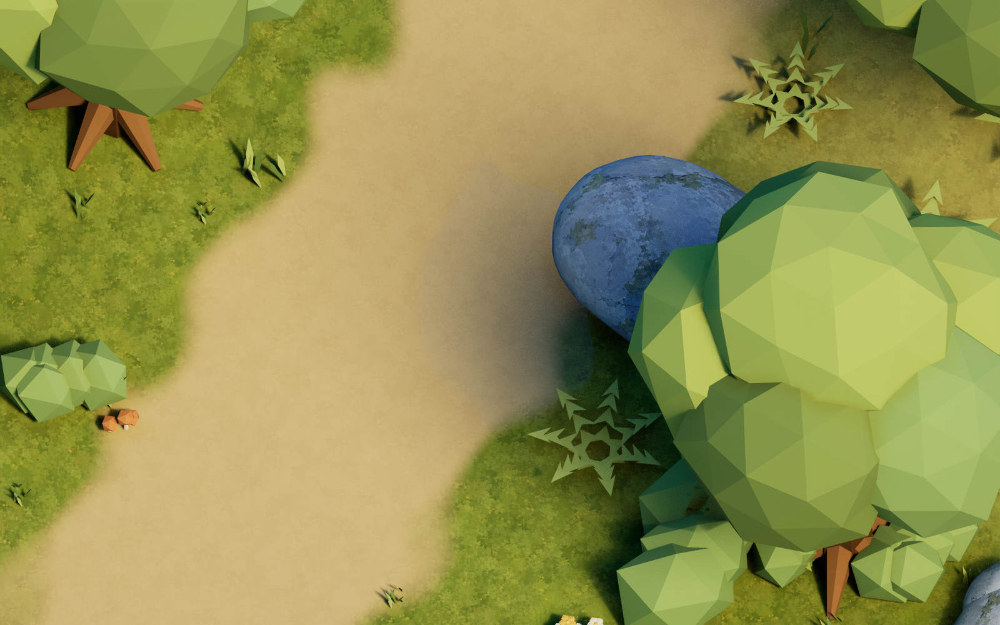
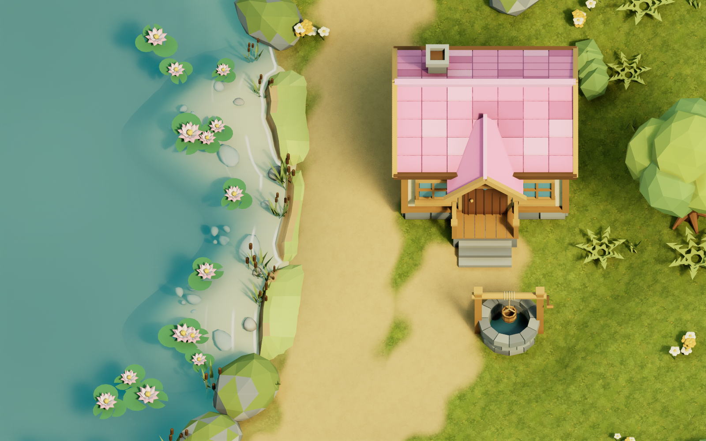

# 호숫가 개선과 실제 하늘을 반사하는 물웅덩이

2026-09-07 기준. 집 앞 해안에는 사용자가 승인한 1~7번 개선을 적용하고, 물웅덩이는 최신 지시에 따라 **실제 하늘·주변 사물을 반사하며 시선 각도에 따라 반사 강도가 달라지는 방식**으로 전환한다. `puddle_cloud_trick.py`의 구름 그림 착시는 이전 실험으로 보관하며 현재 적용 순서에서는 호출하지 않는다. 호수와 개울은 계속 하늘·구름 반사 대상에서 제외한다.

## 승인된 해안 개선 1~7

| 번호 | 화면 목표 | 구현과 현재 확인 범위 |
| --- | --- | --- |
| 1 | 얇고 불규칙한 흰 접촉 포말 | 실제 물높이와 지형이 만나는 57점 윤곽의 56개 선분에서 가장 가까운 거리를 계산한다. `UE_ShorelinePolish.png`에서 얇은 흰 접촉선을 확인했다. |
| 2 | 물가 쪽으로 천천히 오는 1~2개 잔물결 띠 | 폭 8cm, 이동 속도 4cm/s의 띠를 구현했고 정적 UE 화면에서 1~2개 띠를 확인했다. 실제 게임 13.011초/18.002초 렌더에서 물가 쪽 이동을 확인했다. |
| 3 | 얕은 민트색에서 깊은 청록색으로 이어지는 수심색 | 바닥이 비치는 수심별 색과 투과 표현을 포말과 함께 확인했다. 수심 제한 48cm와 표면 노멀·시선각 Fresnel을 사용해 깊은 곳의 밝은 띠를 억제한다. |
| 4 | 모래 바닥의 큰 삼각면 인상 완화 | 현장 바닥의 상면 노멀을 부드럽게 보간하고 UE 재계산을 끈다. 모래 3재질 색 차이는 최대 약 4.1%로 줄이고 약한 월드 좌표 무늬를 사용한다. |
| 5 | 깊은 바닥의 외곽 경계 숨김 | 외곽을 기존 지형에 맞추고 VertexColor B로 원본 수중 바닥색에 연결한다. 깊이 전이는 15~110cm이며 외곽에서는 원본의 거칠기·반사값도 맞춘다. |
| 6 | 해안 폭·돌출·작은 만의 변화 | 두 군데의 넓은 돌출부와 중앙의 작은 만으로 모래 선반 폭을 변화시킨다. 수중 돌은 변경된 바닥 높이에 맞춰 다시 배치한다. |
| 7 | 물이 닿는 흙·돌의 짙은 젖은 띠 | 월드 수면 10cm 기준, 바로 위 약 15cm 범위에 좁은 어두운 띠를 만든다. 기존 해안 바위에는 복제한 `Wet_*` 재질을 액터 슬롯으로 적용한다. |

물웅덩이의 실제 하늘 반사는 이 1~7번과 별도의 최신 추가 지시다. 해안은 별도 검토 맵에서 정적 렌더와 저장 후 재읽기를 확인했으며, 실제 게임 시간에 따른 움직임은 두 시각의 렌더 기록으로 구분해 판단한다. 최종 완료 판정은 아래 검증 JSON의 결과를 따른다.

## 적용 범위와 보존되는 원본

- 가져오는 메시: 범용 키트 **9개**와 지형에 맞춘 현장 메시 **4개**, 총 **13개**. 현장에는 바닥 1개·흙턱 3개·수중 돌 12개를 합한 **16개 `AST_Shoreline_` 액터**를 생성·갱신한다.
- 기존 큰 돌벽 **5개**는 숨기고 충돌을 끈다. 삭제하지 않으며 최초 상태는 `Saved/Shoreline/original_actor_states_<maphash>/`에 변경 전에 저장한다.
- 기존 `Rocks/LakeShore` 그룹의 **39개 액터**에는 젖은 바위 재질을 슬롯 오버라이드로 적용한다. 숨겨 둔 액터는 계속 숨겨져 있다. 원본 바위 재질과 공유 메시 슬롯은 수정하지 않는다.
- 시각용 해안 액터는 `NoCollision` 프로필·컴포넌트 충돌 비활성·액터 충돌 비활성을 함께 저장한다. 보행 충돌은 기존 Landscape가 담당한다.
- 호수·개울 액터에는 포말을 포함한 별도 물 재질을 오버라이드한다. 원본 `M_Water`와 수면 메시 자산은 보존한다.
- 실제 반사는 기존 **물웅덩이 5개**에만 적용한다. 기본 새 재질은 `/Game/Astra/Materials/Shoreline/M_PuddleSkyReflection`이며 원본 `M_PuddleReflection`은 보존한다.
- 검증은 `L_AstraShorelinePolishModuleReview`와 `L_AstraPuddleSkyModuleReview`라는 별도 맵에서 수행한다. 이 검토를 위해 원본 `L_AstraWoodland`, 원본 Landscape·물·바위 재질을 덮어쓰지 않는다. 아래 적용 함수를 원본 맵에서 명시적으로 실행하면 그 맵의 배치와 슬롯 오버라이드를 저장한다.

원본 담당 작업에서는 실제 하늘 반사 웅덩이와 수중 돌 4개 메시의 부드러운 노멀을 먼저 적용했다고 확인했다. **해안 1~7번 전체는 현재 별도 검토 맵의 결과이며, 원본에는 커밋 전달 후 통합할 범위**다. 이 구분을 유지하고 원본에도 모두 적용됐다고 해석하지 않는다.

수중 돌의 `M_SubmergedStone`, `Light`, `Dark` 슬롯은 유지하되 세 재질의 기준색을 하나로 통일했다. 동일한 월드 좌표에서 ±1.2%의 연속 색 변화와 젖은 띠를 사용해, 부드러운 노멀 위에 삼각면별 색이 다시 드러나는 현상을 줄인다. 이 마지막 색 통일도 해안 재질 재생성으로 전달한다.

## 원본 프로젝트에 적용하는 순서

**원본 생성 파이프라인을 모두 마친 뒤 아래 두 함수를 마지막에 실행한다.** 전체 맵 재생성, 물 재질 갱신, 메시 재가져오기 또는 액터 재배치가 뒤에 실행되면 오버라이드가 사라질 수 있으므로 아래 순서를 다시 실행한다.

1. 원본 집·우물·Landscape 높이·연결 수면·하늘 환경의 생성과 갱신을 먼저 마친다. 실제 반사를 받을 SkyLight와 하늘 돔이 준비되어 있어야 한다.
2. 지형 높이 또는 배치를 바꿨다면 Blender의 `Scripts/place_shoreline_blender.py`를 다시 실행해 현장 FBX와 `shoreline_site.json`을 갱신한다. 키트 형상 자체를 바꾼 경우에는 `build_shoreline_kit.py`도 먼저 실행한다.
3. 의도한 기존 `/Game/Astra/Maps/` 맵을 **전체 UE 에디터**에서 연다. 아래 UE Python을 실행한다.

```python
import sys
from pathlib import Path
import unreal

scripts = str(Path(unreal.Paths.project_dir()).resolve() / "Scripts")
if scripts not in sys.path:
    sys.path.insert(0, scripts)

import apply_shoreline_polish
shoreline_report = apply_shoreline_polish.apply_polish(save=True)

import puddle_sky_reflection
puddle_report = puddle_sky_reflection.apply_puddles(save=True)
assert puddle_report["material"]["passed"], puddle_report
```

`apply_polish()`는 현장 메시 가져오기·배치, 모래/흙/돌 재질, 호수·개울 포말 재질과 기존 해안 바위의 젖은 재질을 함께 적용한다. `apply_puddles()`는 소스 배치 JSON에 기록된 정확히 5개 물웅덩이에 새 반사 재질을 적용한다. 각 함수는 호출 시 현재 열린 맵을 사용하며 임의로 원본 맵을 열거나 새로 생성하지 않는다.

이전 `import_shoreline_site.apply_site()` 단독 호출은 메시 가져오기·현장 배치 점검용으로 남아 있다. 최종 적용에는 이를 포함하는 `apply_polish()`를 사용한다. 다른 생성 스크립트가 같은 경로의 재질을 다시 만들면 최종 적용 함수들을 **다시 마지막에** 호출한다.

## 물웅덩이의 각도별 반사

`puddle_sky_reflection.py`는 Thin Translucent와 Surface ForwardShading을 사용한다. `WaterF0=0.02`를 엔진의 Specular 값으로 변환하고, 엔진 Fresnel이 반사와 배경 투과를 나눈다. 위에서 내려다볼 때에는 바닥이 잘 보이고 낮은 각도에서는 실제 하늘과 주변 나무가 더 강하게 비친다. 별도 Fresnel을 다시 곱하거나 그림 전체를 반사판처럼 덮지 않는다.

웅덩이 재질 자체에는 하늘 텍스처 샘플이나 Emissive 사진 출력을 넣지 않는다. 하늘 그림은 하늘 환경에만 사용한다. 현재 검토 맵의 하늘은 `T_AnimeSkyPanorama`와 별도 `M_PuddleReviewSky` 재질이며, 원본 하늘 자산을 덮어쓰지 않는다. 하늘을 바꾸면 캡처가 갱신될 시간을 두고 같은 카메라에서 다시 확인한다.

조절 값은 `WaterF0`, `SurfaceRoughness`, `TransmissionTint`, `WaveNormalStrength`, `WaveSpeed`, `EdgeDepthFadeCm`이다. 경계는 기존 `SM_Puddle`의 VertexColor R과 기본 4cm DepthFade를 Thin Translucent의 `SurfaceCoverage`에 연결한다. 일반 `Opacity`는 얇은 물 위의 불투명층을 뜻하므로 0으로 유지한다.




## 검토 맵과 검증 기록

| 대상 | 생성·적용 스크립트 | 검토 맵 / 카메라 |
| --- | --- | --- |
| 해안 1~7 | `review_lakeshore_modules.py`, `-AstraModuleReview=Polish` | `L_AstraShorelinePolishModuleReview` / `ShorelinePolish` |
| 실제 하늘 반사 웅덩이 | `review_puddle_sky.py` | `L_AstraPuddleSkyModuleReview` / `PuddleSkyTop`, `PuddleSkyLow` |

게임 검토 실행은 해당 맵과 `-game -AstraReview=<카메라 이름>`으로 촬영하고 종료한다. `UE_PuddleSkyLow.png`에서는 하늘·나무의 실제 반사를, `UE_PuddleSkyTop.png`에서는 바닥 가시성을 확인했다. `UE_ShorelinePolish.png`에서는 얇은 접촉선, 1~2개 물결 띠와 청록 수면 아래 바닥·돌을 확인했다.



최신 UE 5.7.4 Editor 빌드는 12.07초에 통과했다. 저장한 맵을 새 UE 프로세스에서 다시 열어 해안 액터 16개의 `NoCollision`, 기존 바위 39개의 젖은 재질, 포말 그래프 검사 21개, 바닥 1개와 수중 돌 4개의 작성된 노멀 보존을 모두 확인했다.

실제 게임의 움직임 검토에는 `Scripts/render_shoreline_motion.ps1`을 사용한다. `-AstraReviewCaptureSeconds=N`의 기본값은 13초이며, 스크립트는 13초와 18초를 각각 요청하고 UE 로그의 실제 월드 시간을 읽는다. 결과는 `UE_ShorelineMotionT13.png`, `UE_ShorelineMotionT18.png`와 `Saved/Shoreline/GameMotionCaptures.json`에 저장하고 두 시각의 렌더를 최종 해안 검증에 기록한다. `Scripts/verify_shoreline_polish.py`는 저장된 맵의 실제 상태를 재검사한다.

최종 실측·컴파일 로그·정적 렌더·두 시각의 움직임 검토는 모두 통과했다. 두 게임 렌더는 종료 코드 0, 재질 컴파일 오류 0이며 물결이 물가 쪽으로 이동하는 것을 화면 비교로 확인했다. 다음 두 기록에 결과를 모았다.

- `ArtSource/Previews/UE_ShorelinePolishValidation.json`
- `ArtSource/Previews/UE_PuddleSkyValidation.json`

적용 직후의 실측은 `Saved/Shoreline/polish_apply_result.json`, `site_import_result.json`, `PuddleSkyImport.json`에서 확인할 수 있다. 저장 후 재읽기 기록은 `Saved/Shoreline/PolishSavedState.json`이다. 재실행 때 13개 메시의 바운드·슬롯과 16개 현장 액터의 변환·충돌, 39개 바위의 슬롯, 5개 웅덩이의 실제 재질을 다시 읽어 비교한다. 재질 그래프 검사만으로 GPU 컴파일 성공이나 화면 품질 통과를 대신하지 않는다.

Blender/FBX 검증 자료는 `ShorelineSite_FBXValidation.json`, `ShorelineRockNormals_FBXValidation.json`과 별도 `AstraLakeshoreReview.blend`에 보관한다. 바닥 외곽 B 마스크는 1일 때 기존 바닥으로 완전히 연결되고 내부는 0이다. 바닥의 부드러운 노멀과 FBX 색 채널이 UE 가져오기 과정에서 유지되어야 한다.

## 이전 실험 기록

`puddle_cloud_trick.py`, `UE_PuddleCloud.png`, 이전 Puddle/Shoreline/Integrated 검토 맵과 검증 JSON은 개발 이력이다. 구름 착시를 허용했던 이전 지시보다 **실제 하늘 반사와 Fresnel 차등 처리를 요청한 최신 지시가 우선**한다. 원본에 통합할 때 이전 구름 모듈을 마지막에 실행하면 새 웅덩이 재질을 되돌릴 수 있으므로 현재 적용 순서에 섞지 않는다.
