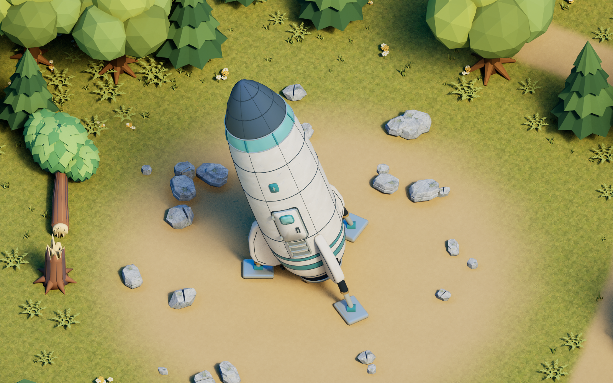
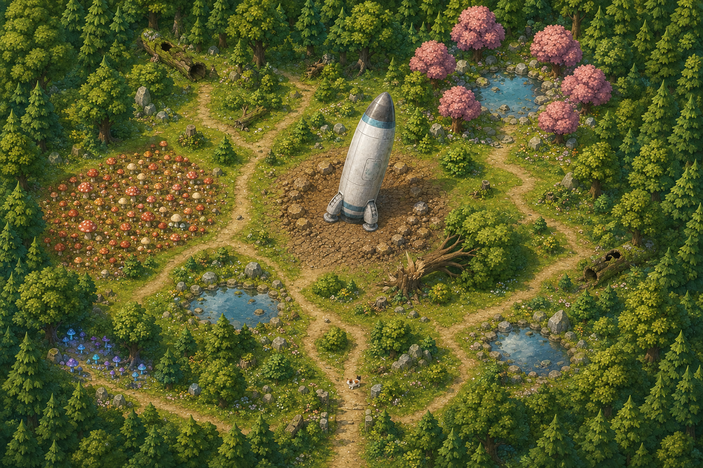
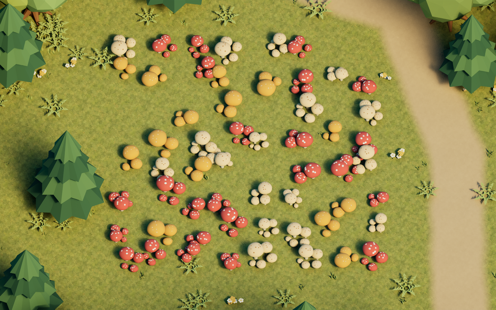
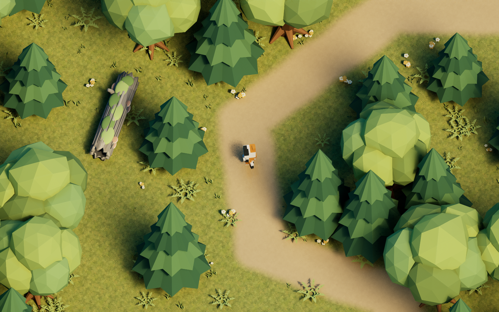

# 별내림 숲 — Astra Starfall

사용자 요청(2026-09-07): 기존과 같은 약 100×100m 새 레벨에 은색 우주선이 기울어 착륙한 공터, 오솔길, 기존보다 큰 웅덩이, 갓 부러진 나무와 오래된 통나무, 15×15m 버섯 군락, 5×5m 발광 버섯 군락, 작은 옹달샘과 분홍 나무를 구성한다. 분홍 수관은 겹겹의 넓은 잎으로 감싼 구형 뭉치다. 새 레퍼런스를 생성한 뒤 우주선 / 나무·통나무 / 버섯·옹달샘 모델링을 병렬 제작했다.

새 맵은 `/Game/Astra/Maps/L_AstraStarfall`이다. UE 임포트·저장 맵 재로드·실제 게임 검증을 완료했다. 아래는 실제 UE 렌더이며 생성한 목표 레퍼런스는 그 아래에 별도로 보관한다.





## 공간과 배치

지형은 100.8×100.8m, 127×127 높이 샘플, 샘플 간격 0.8m다. [공간 설계](../Scripts/starfall_layout.py)는 미터 단위의 Unreal XY를 사용하며, Blender에는 `(X, -Y, Z)`로 배치하고 UE 변환 데이터는 센티미터로 저장한다. 난수 시드는 `90773`이다.

| 공간 | 현재 배치 설계 |
|---|---|
| 착륙 공터 | 중심 `(3.5, 1)m`, 우주선 1대와 착륙 주변 바위 26개. 선체에 16° 기울기를 구워 넣고 세 발의 바닥을 Z=0에 맞췄다. UE에서 기울기를 다시 더하지 않는다. |
| 오솔길 | 공터·버섯 군락·옹달샘·웅덩이를 잇는 4개 경로. 길과 데모 이동 동선에 배치 제외 폭을 둔다. |
| 큰 웅덩이 | 3곳. 기본 가로×세로는 서쪽 10.8×7.4m, 동쪽 12×8.2m, 북쪽 8.4×6.2m이며 가장자리를 불규칙하게 변형한다. |
| 갓 부러진 나무 | 밝은 쪼개진 절단면의 그루터기 1개와 초록 수관이 붙은 쓰러진 나무 1개. |
| 오래된 통나무 | 어두운 속빈 단면·이끼·작은 선반버섯이 있는 통나무 3개. |
| 일반 버섯 | 중심 `(8, -28)m`, 15×15m 구역에 빨강·황토·크림색 군락 56개. 군락 하나는 여러 버섯으로 구성한다. |
| 발광 버섯 | 중심 `(-24, -29)m`, 5×5m 구역에 청록·라일락 군락 13개. 갓 가장자리와 주름, 작은 반점에 발광을 제한한다. |
| 옹달샘 | 중심 `(30, 27)m`, 수면 반지름 2.05m. 낮은 돌테두리와 주변 분홍 나무 7그루. |
| 주변 숲 | 기존 참나무·침엽수 309그루와 장소별 풀·고사리·꽃·수변 식생. |

[배치 데이터](../ArtSource/Layout/starfall_layout.json)에는 **33개 메시 정의(신규 17개, 기존 재사용 16개), 4,488개 배치 기록**이 있다. 이 중 4,118개는 native Foliage 인스턴스로 저장됐으며, 나머지 370개는 개별 메시 배치다. 이 수치는 UE의 최종 액터 수가 아니다. Landscape, 조명, 카메라, 줄기 충돌, 게임 설정 액터는 별도로 생성한다.

고정 탑다운 시점에서 수관이 화면에 투영되는 위치까지 계산해 주요 버섯과 부러진 나무를 가리는 나무 배치를 줄였다. 버섯 군락에는 일반 구역 ±0.64m, 발광 구역 ±0.23m 위치 변화를 주되 전체 메시가 각 구역의 경계 안에 들어오도록 제한한다.

신규 17개 메시의 구성은 우주선 1개, 나무·통나무 키트 6개, 버섯·옹달샘 키트 6개, 수면 메시 4개다. 전체 Blender 장면과 높이 데이터는 [AstraStarfall.blend](../ArtSource/Blender/AstraStarfall.blend), [starfall_height.r16](../ArtSource/Layout/starfall_height.r16)에 저장한다.

## 기존 자산과 조작 유지

**물 반사 머터리얼과 스카이는 기존 자산을 그대로 재사용한다.** 네 수면 모두 `/Game/Astra/Materials/Shoreline/M_PuddleSkyReflection`을 참조한다. 새 수면 메시에는 둘레에서 0이 되는 버텍스 마스크를 넣어 경계를 부드럽게 연결한다. 물 반사용 구름 이미지를 수면에 새로 매핑하지 않는다.

[UE 임포트 스크립트](../Scripts/import_starfall_level.py)는 기존 숲의 `CloudSkyDome`, Directional Light, Sky Light, Sky Atmosphere, Exponential Height Fog, Post Process 설정을 새 맵에 유지한다. 태양의 Light Source Angle 50°도 이 환경 설정을 따라간다. 새 맵 전용 지면 머터리얼은 기존 숲 바닥 텍스처에 별내림 숲의 길·공터·웅덩이 마스크를 적용한다. 새 자산은 `Meshes/Starfall`, `Materials/Starfall`, `Textures/Starfall`, `Foliage/Starfall` 아래에 저장하며, 임포트 스크립트는 기존 Content 파일의 해시를 전후 비교하도록 구성했다.

물빛이 우윳빛으로 보이는 현상은 물 머터리얼을 바꾸지 않고 `M_SF_Landscape`의 물밑 지면색을 조정했다. 현재 지면 셰이더는 해당 마스크에 선형 RGB `(0.035, 0.09, 0.11)`을 바탕으로 바닥 질감 명암을 곱한다. 최종 배치와 물밑색은 저장 맵 재검증과 실제 렌더로 확인했다.

`Config/DefaultEngine.ini`의 `EditorStartupMap`과 `GameDefaultMap`은 `/Game/Astra/Maps/L_AstraWoodland`를 유지한다. 별내림 숲은 맵을 직접 열거나 명령행에 맵 경로를 지정해 실행한다. WASD 고양이 이동과 회전하지 않는 탑다운 카메라는 기존 `AstraGameMode`를 사용한다.

새 맵의 `StarfallLevelConfig` 액터에는 7개 P 데모 경로와 `ValidationPrefix=SF`를 저장한다. `AAstraLevelConfig`가 있는 맵에서는 해당 경로를 사용하고, 설정 액터가 없는 기존 숲에서는 원래 데모 경로를 사용한다. 새 데모 검증 결과는 `UE_SFDemoValidation.json`, 개별 촬영은 `UE_Demo_SF*.png`로 구분한다.

## 모델 원본과 새 레퍼런스

| 대상 | Blender 원본 / 제작 스크립트 | 상세 레퍼런스 / 메타데이터 |
|---|---|---|
| 우주선 | [StarfallSpaceship.blend](../ArtSource/Blender/StarfallSpaceship.blend) / [build_starfall_spaceship.py](../Scripts/build_starfall_spaceship.py) | [우주선 레퍼런스](../ArtSource/Reference/Starfall/Ref_StarfallSpaceship.png) / [starfall_spaceship.json](../ArtSource/Layout/starfall_spaceship.json) |
| 부러진 나무·통나무·분홍 나무 3종 | [StarfallTrees.blend](../ArtSource/Blender/StarfallTrees.blend) / [build_starfall_trees.py](../Scripts/build_starfall_trees.py) | [나무 레퍼런스](../ArtSource/Reference/Starfall/Ref_StarfallTrees.png) / [starfall_trees.json](../ArtSource/Layout/starfall_trees.json) |
| 버섯 3종·발광 버섯 2종·옹달샘 돌테두리 | [StarfallFungiSpring.blend](../ArtSource/Blender/StarfallFungiSpring.blend) / [build_starfall_fungi_spring.py](../Scripts/build_starfall_fungi_spring.py) | [버섯·옹달샘 레퍼런스](../ArtSource/Reference/Starfall/Ref_StarfallFungiSpring.png) / [starfall_fungi_spring.json](../ArtSource/Layout/starfall_fungi_spring.json) |

FBX는 `ArtSource/Meshes/Starfall`에 보관한다. 선체용 새 이미지 텍스처는 [T_SF_ShipPaint.png](../ArtSource/Textures/Starfall/T_SF_ShipPaint.png)이며, 생성한 레퍼런스 4장과 텍스처의 프롬프트는 [GENERATION_PROMPTS.md](../ArtSource/Reference/Starfall/GENERATION_PROMPTS.md)에 남겼다. 실제 렌더용 돌 페인트는 기존 `T_AnimeForestRockPaint.png`를 재사용한다.

## 재생성 순서

먼저 Astra 에디터와 해당 프로젝트의 게임 실행을 종료한다. 아래는 현재 설치 경로를 사용하는 PowerShell 예시다. 새 레퍼런스와 선체 텍스처는 저장된 파일을 입력으로 사용한다.

```powershell
$sfProject = 'D:\github\ue5astra\AstraLevelTest'
$sfBlender = 'C:\Program Files\Blender Foundation\Blender 4.5\blender.exe'
$sfEditor = 'C:\Program Files\Epic Games\UE_5.7\Engine\Binaries\Win64\UnrealEditor.exe'
$sfBuild = 'C:\Program Files\Epic Games\UE_5.7\Engine\Build\BatchFiles\Build.bat'

# 1. 독립 모델 키트 3개 재생성. 서로 다른 출력 파일을 사용한다.
foreach ($sfKit in @('spaceship', 'trees', 'fungi_spring')) {
    & $sfBlender --factory-startup -b --python "$sfProject/Scripts/build_starfall_$sfKit.py"
    if ($LASTEXITCODE -ne 0) { throw "Blender kit failed: $sfKit" }
}

# 2. 전체 배치, 수면 메시, 높이맵, 지면 마스크 내보내기.
& $sfBlender --factory-startup -b --python "$sfProject/Scripts/build_starfall_scene.py"
if ($LASTEXITCODE -ne 0) { throw 'Blender scene export failed.' }

# 3. 높이맵 생성 함수와 레벨별 P 데모 설정을 포함한 Editor 타깃 빌드.
& $sfBuild AstraLevelTestEditor Win64 Development "-Project=$sfProject/AstraLevelTest.uproject" -WaitMutex -NoHotReloadFromIDE -NoUBA "-log=$sfProject/Saved/StarfallBuild.log"
if ($LASTEXITCODE -ne 0) { throw 'Editor build failed.' }

# 4–5. 전체 UE 에디터에서 임포트한 뒤, 별도 에디터 프로세스로 저장된 맵 재검증.
foreach ($sfScript in @('import_starfall_level', 'validate_starfall_level')) {
    $sfStarted = Get-Date
    $sfArgs = @("$sfProject/AstraLevelTest.uproject", '-nosplash', '-unattended', '-NoSound',
        "-ExecutePythonScript=$sfProject/Scripts/$sfScript.py", "-abslog=$sfProject/Saved/$sfScript.log")
    $sfRun = Start-Process -FilePath $sfEditor -ArgumentList $sfArgs -WindowStyle Hidden -Wait -PassThru
    if ($sfRun.ExitCode -ne 0) { throw "UE script failed: $sfScript" }
    $sfReportName = if ($sfScript -eq 'import_starfall_level') { 'UE_StarfallImportValidation' } else { 'UE_StarfallReloadValidation' }
    if ((Get-Item -LiteralPath "$sfProject/ArtSource/Previews/$sfReportName.json").LastWriteTime -lt $sfStarted) { throw "Stale report: $sfReportName" }
    $sfReport = Get-Content -LiteralPath "$sfProject/ArtSource/Previews/$sfReportName.json" -Raw | ConvertFrom-Json
    if (-not $sfReport.passed) { throw "Validation failed: $sfReportName" }
}

# 6. 실제 게임 렌더 7장. -Views로 원하는 SF 카메라만 지정할 수도 있다.
& "$sfProject/Scripts/render_starfall_reviews.ps1"

# 7. 새 맵을 명시해 실제 P 입력, 7컷 루프, 복귀, WASD를 검증한다.
$sfDemoArgs = @("$sfProject/AstraLevelTest.uproject", '/Game/Astra/Maps/L_AstraStarfall',
    '-game', '-AstraDemoTest', '-windowed', '-ResX=1600', '-ResY=1000', '-NoVSync',
    '-unattended', '-nosplash', "-abslog=$sfProject/Saved/StarfallDemoValidation.log")
$sfDemoStarted = Get-Date
$sfDemo = Start-Process -FilePath $sfEditor -ArgumentList $sfDemoArgs -WindowStyle Hidden -Wait -PassThru
if ($sfDemo.ExitCode -ne 0) { throw 'Starfall demo validation failed.' }
if ((Get-Item -LiteralPath "$sfProject/ArtSource/Previews/UE_SFDemoValidation.json").LastWriteTime -lt $sfDemoStarted) { throw 'Stale Starfall demo report.' }
$sfDemoReport = Get-Content -LiteralPath "$sfProject/ArtSource/Previews/UE_SFDemoValidation.json" -Raw | ConvertFrom-Json
if (-not $sfDemoReport.passed) { throw 'Starfall demo report failed.' }
```

`validate_demo_playback.ps1`은 기존 `L_AstraWoodland`를 명시하는 스크립트이므로 Starfall 검증에는 위와 같이 새 맵 경로와 `-AstraDemoTest`를 함께 지정한다. 저장된 새 맵을 편집용으로 열 때는 `-ExecutePythonScript=.../Scripts/open_starfall_review.py`를 사용한다. `-AstraEditorReview=SFSpaceship`처럼 카메라를 선택할 수 있으며 기본값은 `SFOverview`다.

최초 임포트가 완료된 뒤 모델·재질을 바꾸지 않고 배치만 정리할 때는 `import_starfall_level.py` 실행 인수에 `-AstraStarfallPlacementOnly`를 추가할 수 있다. 이 모드는 이미 임포트한 메시를 로드하고 새 맵 지면 머터리얼과 액터·Foliage 배치를 다시 만든다. 메시 재임포트는 생략하므로 신규 메시가 있거나 모델·수면 형상을 바꾼 경우에는 전체 임포트를 사용한다. 배치만 갱신한 경우에도 저장 맵 재검증과 실제 게임 촬영은 다시 실행한다.

## 확인할 산출물

- Blender 배치 검사: `ArtSource/Previews/StarfallLayout_Validation.json`.
- UE 임포트 보고서: `ArtSource/Previews/UE_StarfallImportValidation.json`. 기존 Content 보존 해시와 새 자산·배치 수를 기록한다.
- 새 프로세스의 저장 맵 검사: `ArtSource/Previews/UE_StarfallReloadValidation.json`. Landscape 내부 높이 15,625점, 메시·재질 슬롯·배치, native Foliage, 물 마스크, 착륙 발 접지, 데모 설정을 검사한다.
- 실제 고정 카메라 렌더: `UE_SFOverview.png`, `UE_SFSpaceship.png`, `UE_SFMushrooms.png`, `UE_SFGlow.png`, `UE_SFSpring.png`, `UE_SFPuddles.png`, `UE_SFBrokenTrees.png`.
- 실제 P 입력 검증: `UE_SFDemoValidation.json` 및 `UE_Demo_SFClearing.png`, `UE_Demo_SFMushrooms.png`, `UE_Demo_SFGlow.png`, `UE_Demo_SFSpring.png`, `UE_Demo_SFOldLogs.png`, `UE_Demo_SFPuddles.png`, `UE_Demo_SFLanding.png`.

최종 재로드 검사를 모두 통과했다. Native Foliage 위치 오차는 0cm이며, 배율 최대 오차는 약 5.96×10⁻⁸, 회전 최대 오차는 약 1.53×10⁻⁵도다. 착륙발 3개의 지면 접촉 높이 오차는 최대 0.00233cm다. 기존 Content 해시와 환경 설정은 임포트 전후 동일하다.

실제 `-AstraDemoTest`는 월드 시간 81.456초에 완료했고 실패 항목은 0개다. 7개 장소의 보행·접지, P 진입·루프·취소·복귀, 위치·카메라·이동 상태 복원, 복귀 후 WASD 네 방향이 통과했다. 네 방향 실제 이동량은 332.3~338.1cm였다. 검토 카메라 7장과 P 데모 7장을 저장했다. 기존 Windows 배포 ZIP은 이번 레벨 추가 후 다시 패키징하지 않았다.

| 일반 버섯 군락 | 오래된 통나무와 실제 고양이 이동 |
| --- | --- |
|  |  |
