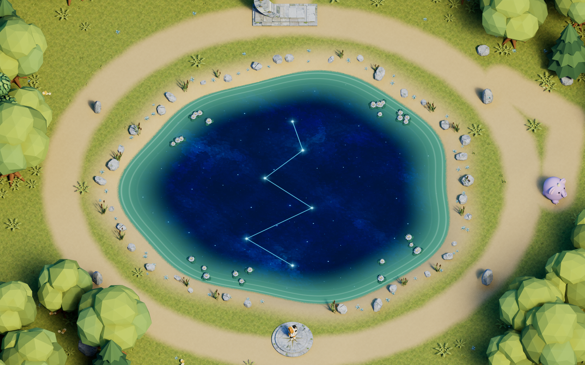
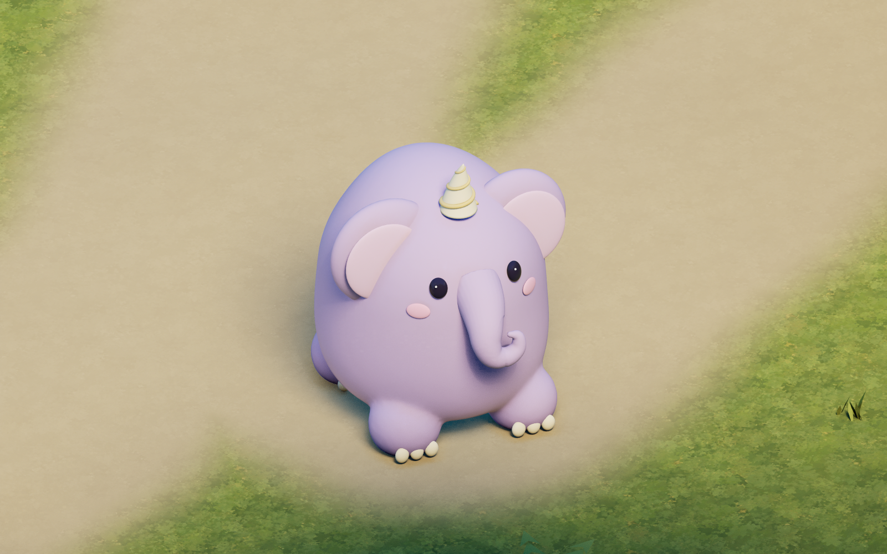
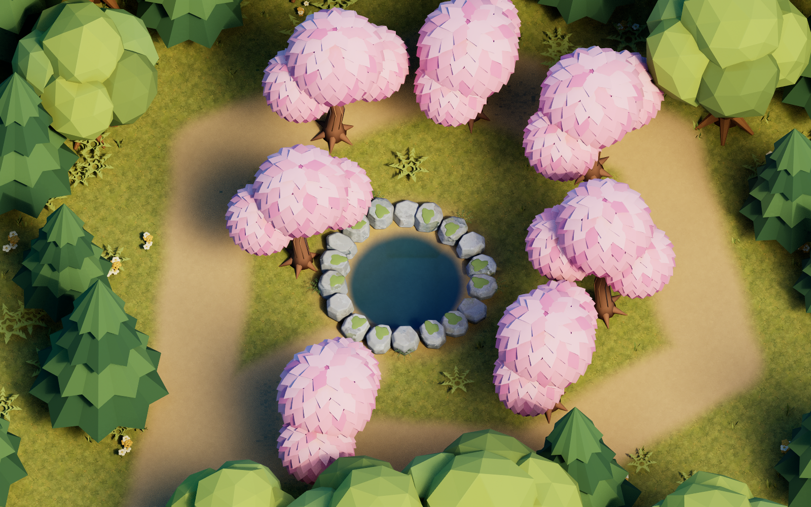
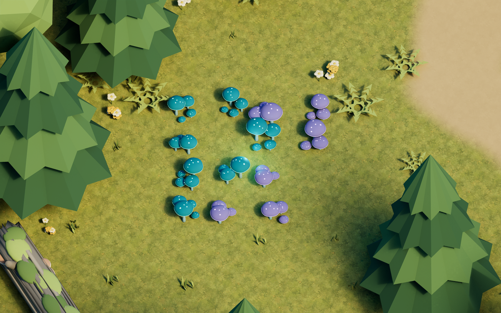
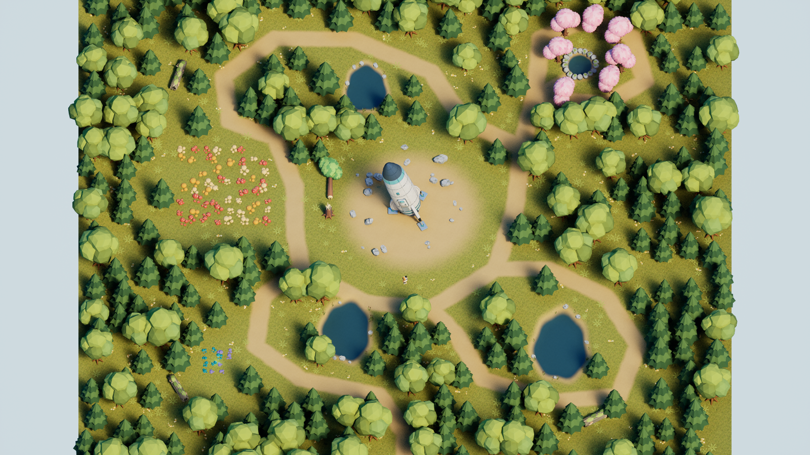
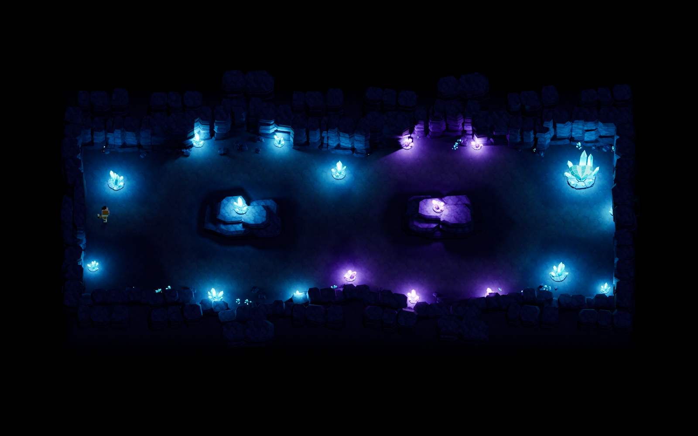
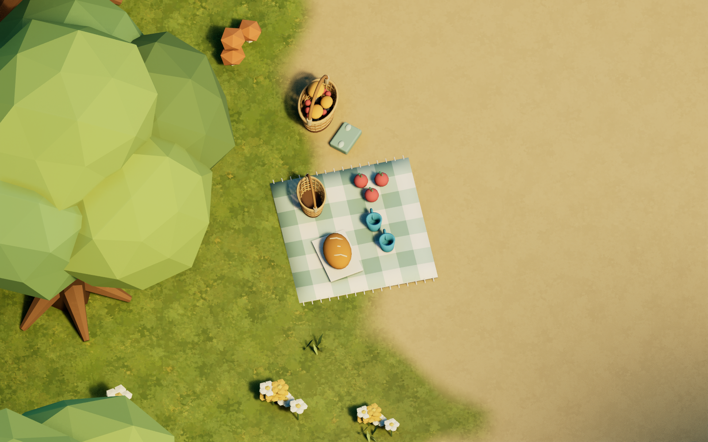
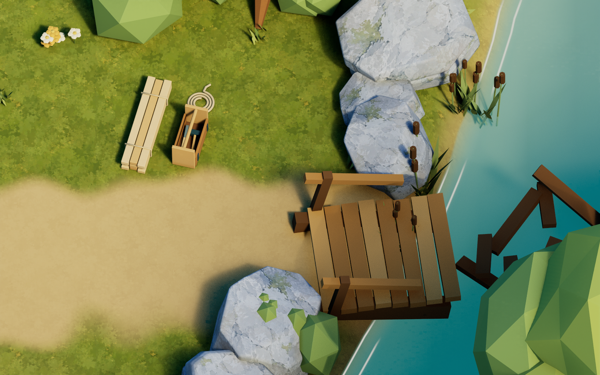
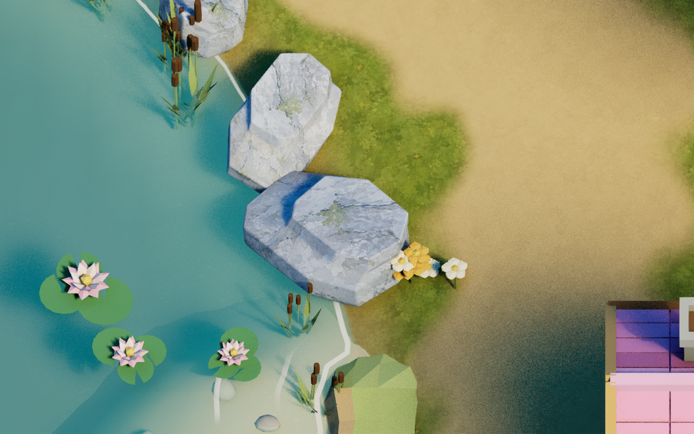
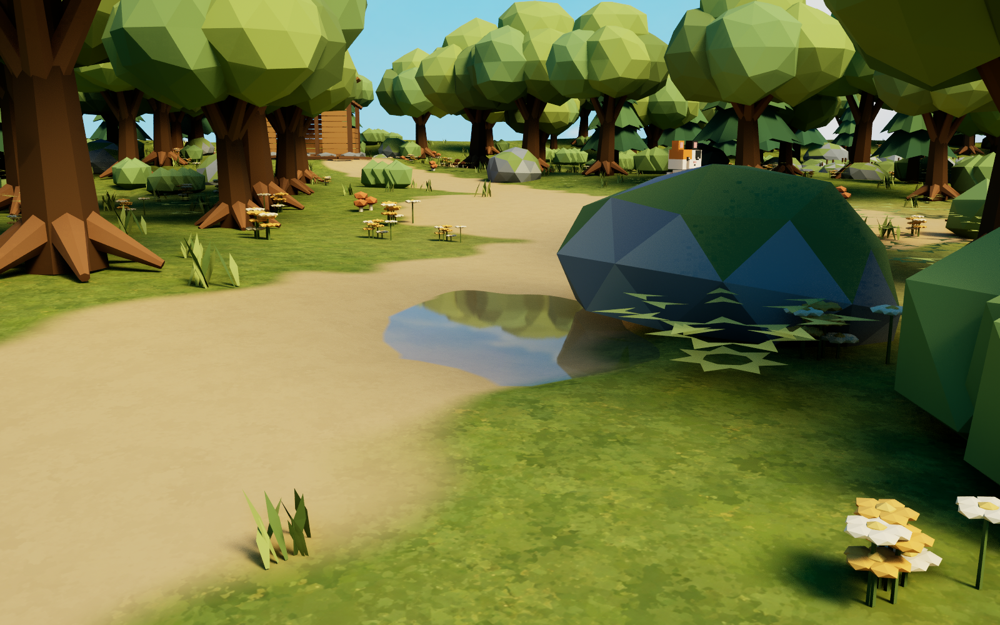

# AstraLevelTest

Unreal Engine 5.7.4 프로젝트. 약 100m 숲을 탐색하는 직립 보행 삼색 고양이 게임.

**별이 잠긴 연못**에는 낮에도 밤하늘을 품은 연못, 별자리 관측대, 초승달 석문, 은백색 연꽃과 버드나무가 있다. 관측대에 가까이 서면 물속 여섯 별이 이어진다. 연못 북쪽에는 앞뒤로 긴 통통한 체형의 뿔 달린 코끼리가 쉬고 있다.

`/Game/Astra/Maps/L_AstraStarPond`를 열고 Play하거나 `Scripts/play_starpond.ps1`로 실행한다. WASD와 P 자동 산책을 지원한다. 코끼리는 16본 스켈레톤으로 호흡·귀·코·꼬리·눈깜빡임을 포함한 8초 제자리 아이들을 반복한다. [연못 제작 원본·재생성·검증](Docs/StarPondLevel.md).

새 레벨 **별내림 숲**에는 16도 기울어 착륙한 우주선, 큰 웅덩이 3곳, 갓 부러진 나무와 오래된 통나무, 15×15m 버섯 군락, 5×5m 발광 군락, 분홍 나무로 둘러싸인 옹달샘이 있다. 아래는 실제 UE 실행 화면이다.

| 분홍 나무와 옹달샘 | 작은 발광 버섯 군락 |
| --- | --- |
|  |  |

`Content/Astra/Maps/L_AstraStarfall`을 열고 Play하면 기존과 같은 WASD 이동과 P 자동 산책을 사용할 수 있다. 기존 기본 맵은 유지한다. 물 반사와 스카이는 기존 자산을 재사용했다. [새 레벨 구성·모델·레퍼런스·재생성](Docs/StarfallLevel.md)을 참고한다.

별도 **발광석 동굴** 맵을 추가했다. 약 50×30m 내부에서 청록색·보랏빛 결정이 길과 암벽을 비추며 두 차례 갈림길을 지난다. 기존 삼색 고양이의 WASD와 고정 탑다운 카메라를 사용한다.

`/Game/Astra/Maps/L_AstraCrystalCave`를 열고 Play하거나, PowerShell에서 `Scripts/run_cave.ps1 -Mode Open`을 실행한다. [동굴 제작 원본·재생성·검증](Docs/CrystalCaveLevel.md)을 참고한다. 아래 숲 화면과 별도로 만든 실제 UE 레벨이며, 생성 레퍼런스는 제작 자료 폴더에 구분해 보관한다.

실제 언리얼 실행 화면. 숲과 공터를 중심으로 호수, 개울, 나무다리와 목조 폐허가 이어진다.

낚시터와 집 주변에는 잠시 사람이 자리를 비운 듯한 생활 소품을 더했다. 나무 데크 위의 낚시 자리, 작은 텃밭과 빨랫줄, 공터의 피크닉, 무너진 다리 옆의 수리 도구가 각 장소의 용도를 보여준다.

| 호수의 나무 낚시터 | 핑크 집 앞의 생활 공간 |
| --- | --- |
|  |  |

| 나무 그늘의 피크닉 | 무너진 다리의 수리 자리 |
| --- | --- |
|  |  |

| 삼색 고양이와 나무다리 | 호수의 연꽃과 수초 |
| --- | --- |
|  |  |

## 조작

- WASD: 화면 기준 상하좌우 이동
- P: 주요 장소 7곳의 자동 산책 촬영 모드 진입 / 시작 전 플레이 상태로 복귀
- 카메라: 회전 없는 고정 58도 직교 시점, 캐릭터 추적
- 마우스 입력 없음

`AstraLevelTest.uproject`를 UE 5.7로 열고 기본 맵에서 Play를 누른다. 에디터가 키보드 입력을 받도록 플레이 뷰포커스가 필요하다. P 데모 모드는 장소별로 순간이동한 뒤 자동으로 걸으며 약 72초의 7개 컷을 반복한다. P를 다시 누르면 원래 위치와 카메라로 복귀한다. [촬영 모드 사용법·컷 구성](Docs/DemoPlayback.md)을 참고한다.

## Windows x64 실행

패키지는 저장소의 `Builds/AstraLevelTest_Win64/Windows`, 배포 ZIP은 `Builds/AstraLevelTest_Win64_DLSS.zip`에 생성한다. 압축을 모두 풀고 `AstraLevelTest.exe`를 실행하면 3840×2160 출력과 DLSS Performance(내부 1920×1080)를 사용한다.

- `Play_1080p_Native.cmd`: 1920×1080 네이티브.
- `Play_4K_Native.cmd`: 3840×2160 네이티브.
- `Play_4K_DLSS.cmd`: 기본 4K DLSS 모드.

P 데모 진입·복귀와 WASD를 사용할 수 있다. [빌드 환경·실행 설정](Docs/WindowsPackage.md)과 [패키지 검증 결과](VALIDATION.md#windows-x64-패키지와-dlss--2026-09-07)를 참고한다.

## 작업 자료

- `WORK_INSTRUCTIONS.md`: 사용자의 전체 작업 지시
- `ArtSource/Reference`: 전체 및 개별 모델링 참고 이미지, 생성 프롬프트
- `ArtSource/Textures`: 생성한 지면·암벽·하늘 파노라마·낚시터 목재 텍스처와 과거 물웅덩이 구름 이미지
- `ArtSource/Blender/AstraWoodland.blend`: 모델과 전체 배치의 블렌더 원본
- `ArtSource/Meshes`: 블렌더에서 내보낸 FBX 모델
- `ArtSource/Layout/woodland_layout.json`: 블렌더에서 추출한 배치·재질·축변환 데이터
- `ArtSource/Layout/landscape_height.r16`: 실제 Landscape로 가져올 127×127 높이맵
- `ArtSource/Previews`: 블렌더 배치 렌더와 언리얼 검증 이미지

현재 Blender 배치 원본은 메시 정의 **56종**, 배치 기록 **1,820개**이며, `foliage_placement.json`에는 작은 식물 **1,963개**의 변환이 있다. 배치 기록에는 숨겨 보존한 기존 오브젝트도 포함된다. 실제 엔진 적용과 검증 범위는 [VALIDATION.md](VALIDATION.md)에 기록한다.

## 재생성

1. Blender 4.5 이상에서 `Scripts/build_blender_scene.py` 실행. 원본 `.blend`, FBX, JSON, 높이맵을 생성한다.
2. 숲 확장 원본은 `build_forest_cliffs.py`, `build_forest_tent.py`, `build_forest_signs.py`, `build_forest_cooking.py`로 각각 생성한다. 이어 `place_forest_expansion.py`를 Blender에서 실행해 절벽·야영지와 진입로 높이를 전체 배치에 합친다. 바위는 `build_smooth_forest_rocks.py`와 `apply_smooth_rocks_blender.py`로 기준 원본을 준비한 뒤 `build_fractured_forest_rocks.py`, `apply_fractured_rocks_blender.py` 순서로 최신 형태를 적용한다. 낚시터·생활 소품은 `build_fishing_dock.py`, `build_fishing_props.py`, `build_home_life_props.py`, `build_woodland_life_props.py`로 생성하고 `place_life_props.py`로 전체 배치에 합친다. Blender CLI는 `--factory-startup -b --python 스크립트경로`로 실행한다.
3. UE 5.7용 `AstraLevelTestEditor` 빌드.
4. **전체 언리얼 에디터**에서 `Scripts/import_unreal_scene.py` 실행. `-ExecutePythonScript=...`로도 실행할 수 있다. Content Browser를 사용하므로 UI 없는 Python commandlet로 텍스처 가져오기를 실행하지 않는다.
5. `Scripts/import_forest_expansion.py`로 숲 확장·해안 모듈·파노라마 하늘을 적용한다. 이 스크립트는 기존 Landscape와 맵을 보존하면서 갱신한다. 이어 UE에서 `import_smooth_rocks.py`, `apply_forest_foliage.py` 순서로 바위와 작은 식물을 적용한다.
6. **Blender에서 `Scripts/place_life_props.py`를 다시 실행한다.** 앞 단계의 `apply_forest_foliage.py`가 `foliage_placement.json`을 새로 작성하므로, 보관한 기준 배치에서 생활 소품 영역을 다시 제외해 1,963개의 Foliage 데이터를 복원해야 한다. 모델 생성 단계에서 이미 배치했더라도 이 재필터 단계를 생략하지 않는다.
7. 전체 UE 에디터에서 `import_life_props.py`, `apply_shoreline_finish.py`, `apply_native_puddles.py` 순서로 생활 소품·해안 마감·실제 반사 웅덩이를 적용하고 `/Game/Astra/Maps/L_AstraWoodland`를 열어 Play한다.
8. `import_fractured_rocks.py`로 바위 5종의 최신 형상을 적용한다. 기존 자산 경로·배치·재질 오버라이드를 유지하며 메시만 저장한다. `validate_forest_scene.py`로 저장된 자산을 다시 확인한다.

최신 해안 개선과 물웅덩이를 포함하려면 원본 집·지형·물·하늘 갱신이 모두 끝난 다음, 의도한 맵의 UE Python에서 `apply_shoreline_polish.apply_polish(save=True)`를 실행하고 이어서 `puddle_sky_reflection.apply_puddles(save=True)`를 실행한다. 이 두 호출을 **생성 파이프라인의 마지막**에 둔다. 이후 원본 맵·재질·액터를 다시 생성하면 같은 순서를 다시 적용한다. [전체 실행 예제와 검증 범위](Docs/ShorelineIntegration.md)를 참고한다.

레벨 생성 스크립트는 생성된 맵을 다시 작성한다. 수동 편집을 유지하려면 다른 이름으로 복사한 맵을 사용한다. 블렌더에서 수정한 배치를 전달할 때에는 동일한 JSON 구조를 유지한다.

블렌더 원본을 열고 직접 위치·회전·크기를 변경한 뒤에는 `Scripts/export_blender_layout.py`를 실행한다. 이 스크립트는 현재 배치를 그대로 추출하며 다시 흩뿌리지 않는다. 지형은 XY 격자를 유지하고 Z 높이만 수정하면 Landscape 높이맵으로 추출된다.

## 기술 메모

지형은 일반 스태틱 메시가 아닌 Unreal Landscape이다. 오브젝트는 Blender의 미터 단위 변환을 센티미터 단위로 바꿔 배치한다. 큰 구조물에는 삼각형 충돌, 나무에는 별도의 줄기 충돌을 사용한다. 작은 장식물은 이동을 막지 않는다.

Directional Light Source Angle은 사용자 지정값인 50도이며 Exponential Height Fog를 약하게 적용했다. 호수와 개울은 겹침 없는 하나의 수면 메시를 사용한다. 버텍스 경계 마스크와 DepthFade로 가장자리를 부드럽게 하고, 최신 아트 지시대로 구름 반사 없이 맑은 청록색과 수심 차이를 표현한다.

핑크 집의 현관은 게임 카메라 쪽인 UE −X를 바라보고 우물은 앞마당에 있다. `import_pink_house_scene.py`는 기존 맵을 `ArtSource/Backups`에 보관한 뒤 배치한다. 집터의 기존 식생 22개와 줄기 충돌은 `PreservedBeforePinkHouse` 폴더에 숨겨 보존했다. `refresh_house_terrain.py`는 기존 Landscape 편집 레이어에 높이를 갱신하고 집·우물·계단 앞의 충돌 높이를 검증한다.

`ReviewCameras`는 전체 배치·집·호수·야영지·절벽·이정표와 하늘 세 방향을 반복 촬영하기 위한 카메라다. 플레이 카메라는 고양이의 카메라 하나이며, 촬영 카메라들은 일반 플레이에서 선택되지 않는다.

게임 실행 인자 `-AstraSmokeTest`는 WASD 입력 이벤트를 순서대로 주입하고, 이동 방향·접지·카메라 회전 고정을 검사한다. `-AstraReview=Overview` 등의 검토 인자는 엔진 렌더를 저장하고 해당 검토 실행을 종료한다. 일반 플레이에는 이 동작이 없다.

`Scripts/render_reviews.ps1`로 Gameplay, Overview, Lake, Cabin, Puddle 렌더를 저장한다. `-AstraBridgeTest -AstraReview=Bridge`는 정상 다리 횡단을 검사한다. 실제 결과는 [VALIDATION.md](VALIDATION.md)에 기록했다.

## 독립 호숫가 메시 키트

얕은 모래 바닥 2종, 낮은 흙 턱 3종, 수중 돌·자갈 4종과 현장용 메시 4종을 제공한다. 집 앞 해안 12m 구간에 바닥·낮은 턱·수중 돌 16개를 적용했다. [메시 목록](ArtSource/Meshes/Shoreline/README.md)과 [통합 방법](Docs/ShorelineIntegration.md)을 참고한다.

해안 마감은 얇은 흰 접촉선, 물가로 다가오는 1~2개 잔물결, 수심별 민트·청록색, 부드러운 모래 바닥과 외곽 연결, 돌출부·작은 만, 젖은 흙·돌을 포함한다. 수중 돌 재질 3종의 기준색과 연속 무늬를 통일해 삼각형별 색 차이도 없앴다. 메인 맵에 적용할 때에는 `apply_shoreline_finish.py`를 사용하며, 기존 숲 배치·Landscape·Foliage 인스턴스가 유지되는지 함께 검사한다.

## 절벽과 야영지

높이 8.035m의 절벽 3종은 층리와 기울기·돌출 형상을 달리했다. 아래가 막힌 긴 메시이므로 지면에 묻어 원하는 높이로 조립할 수 있다. **액터 Z = 원하는 절벽 상단 Z − 803.5cm × Z 스케일**로 맞춘다. 애니 배경풍 암벽 텍스처와 푸른 암부 색, 거친 표면을 적용했다.

숲 뒤편의 약 5.2m 높이 언덕에 절벽 4개를 조립하고 천막·침낭·가방·화톳불·취사 삼각대·조리대·랜턴·장작·통나무 의자를 배치했다. 중앙 공터와 야영지 입구에 호수·천막·집 그림이 있는 나무 이정표를 놓았다. 진입로는 Landscape 경사로이며 기존 길과 연결된다. 원본 식생 51개는 숨겨 보존하고 주변 25개는 변경된 지면 높이에 맞췄다.

`ArtSource/Layout/forest_expansion.json`은 배치 명세, `ForestCliffs.blend`, `ForestTent.blend`, `ForestSigns.blend`, `ForestCooking.blend`는 개별 모델 원본이다. `-AstraCampTest -AstraReview=Camp`는 캐릭터가 경사로를 오르는지 검사한다.

## 낚시터와 생활 소품

새 메시 15종을 4개 독립 키트로 제작했다. 각 Blender 원본과 FBX, 재질 팔레트, 충돌 설정, 생성 레퍼런스를 보관한다.

| 키트 | 메시 구성 | Blender 원본 / 메타데이터 |
| --- | --- | --- |
| 나무 낚시터 1종 | `SM_FishingDock`: 경사 진입로, 말뚝, 넓은 작업 데크와 측면 난간 | `ArtSource/Blender/FishingDock.blend` / `ArtSource/Layout/fishing_dock.json` |
| 낚시 소품 4종 | `SM_FishingRodStand`, `SM_FishingChair`, `SM_FishBucket`, `SM_FishingTackleBox` | `ArtSource/Blender/FishingProps.blend` / `ArtSource/Layout/fishing_props.json` |
| 집 주변 소품 5종 | `SM_HomeClothesline`, `SM_VegetablePatch`, `SM_WateringTools`, `SM_BootsAndBroom`, `SM_HerbDryingRack` | `ArtSource/Blender/HomeLifeProps.blend` / `ArtSource/Layout/home_life_props.json` |
| 숲 생활 소품 5종 | `SM_ChoppingStump`, `SM_ForagingBasket`, `SM_PicnicSet`, `SM_BridgeRepairSupplies`, `SM_WoodHandcart` | `ArtSource/Blender/WoodlandLifeProps.blend` / `ArtSource/Layout/woodland_life_props.json` |

낚시 데크는 호숫가에서 UE +X 방향으로 뻗고, 1.8m 폭의 접근로가 약 4m 폭의 플랫폼으로 연결된다. 말뚝 바닥이 원점이며 로컬 상판 높이는 2.35m다. 배치 명세에서는 액터를 Z −1.50m에 놓아 상판이 월드 Z 0.85m에 오도록 했다. 낚싯대·의자·양동이·열린 도구 상자는 가운데 이동 공간을 비우고 양옆에 모았다. 목재에는 별도 ImageGen 텍스처 `ArtSource/Textures/T_FishingDockWood.png`를 적용한다.

핑크 집 옆에는 빨랫줄·작은 텃밭·물뿌리개와 삽·장화와 빗자루·허브 건조대·손수레를 배치했다. 야영지의 장작더미 옆에는 도끼가 꽂힌 그루터기, 중앙 공터에는 피크닉 담요와 채집 바구니, 무너진 다리 옆에는 새 판자·공구 상자·밧줄을 놓았다. 세부 위치·회전·크기와 식생 제외 영역은 `ArtSource/Layout/life_props_placement.json`에 저장한다.

`Scripts/place_life_props.py`는 기존 배치를 다시 흩뿌리지 않고 새 소품을 합친다. Landscape 높이맵은 유지하고, 소품과 겹치는 원래 오브젝트는 숨겨 보존하며 해당 영역의 Foliage 13개만 제외한다. 작업 전 Blender·배치·높이맵·Foliage 데이터는 `ArtSource/Backups/BeforeLifeProps`에 보관한다. `Scripts/import_life_props.py`는 이 배치 명세를 UE 맵에 적용하는 단계다.

현재 완성된 프로젝트에서 낚시터·생활 소품만 다시 적용할 때는 다음 3단계를 사용한다.

1. Blender에서 `build_fishing_dock.py`, `build_fishing_props.py`, `build_home_life_props.py`, `build_woodland_life_props.py`를 실행해 4개 키트를 생성한다.
2. Blender에서 `place_life_props.py`를 실행해 새 소품 배치와 해당 영역을 제외한 Foliage 데이터를 저장한다.
3. 전체 UE 에디터에서 `import_life_props.py`를 실행해 이 명세를 현재 맵에 적용한다.

이 증분 적용의 2~3단계 사이에 `apply_forest_foliage.py`를 실행하면 필터된 JSON이 덮어써진다. Foliage 전체 재생성이 필요했다면 반드시 `place_life_props.py`를 한 번 더 실행한 뒤 `import_life_props.py`를 실행한다.

각 제작 스크립트는 FBX를 `ArtSource/Meshes`에 내보내고 실제 Blender 프리뷰를 `ArtSource/Previews/Blender_FishingDock.png`, `Blender_FishingProps.png`, `Blender_HomeLifeProps.png`, `Blender_WoodlandLifeProps.png`에 저장한다. `Scripts/validate_fishing_dock.py`는 데크 FBX를 새로 가져와 원본과 경계·UV·노멀·재질·표면 높이를 비교한다. 이 검사는 에셋 검증이며, 최종 UE 렌더와 캐릭터 이동 결과는 [VALIDATION.md](VALIDATION.md)를 확인한다.

## 하늘

`T_AnimeSkyPanorama.png`는 별도 생성한 2:1 하늘 전용 파노라마다. `M_CloudSky`는 월드 방향을 경도·위도 UV로 변환하고 이음새와 극점을 부드럽게 합성한다. 호수·개울은 구름 반사 없이 유지한다.

작은 웅덩이 5개는 `M_PuddleSkyReflection`의 Thin Translucent 재질로 실제 하늘과 주변 환경을 반사한다. 물의 기본 반사율 F0는 0.02이며 엔진의 프레넬로 낮은 시점에서 반사가 강해진다. 수면에 하늘 텍스처나 발광 이미지를 직접 연결하지 않는다. 버텍스 마스크와 DepthFade는 투과와 반사의 경계를 함께 부드럽게 한다. 이전 생성 구름 이미지와 착시 재질은 작업 기록으로 보존한다.

고정 탑다운 시점에서는 바닥 투과가 우세해 반사가 은은하고, 낮은 시점에서는 아래처럼 나무·바위·하늘이 선명해진다. 아래 이미지는 반사 확인용 카메라이며 플레이 카메라는 고정 탑다운이다.

## 바위 형태와 Foliage

숲 바위 5종은 넓게 깨진 면, 갈라진 쐐기, 층리 판석, 기울어진 절리, 돌출 어깨 형태로 구분했다. 전체 Subdivision으로 둥글어지던 형상을 없애고 모서리만 완만하게 다듬어 부드러운 셰이딩을 유지한다. 삼각형 수는 순서대로 476 / 668 / 1,620 / 664 / 1,270개다. ImageGen 텍스처 `T_AnimeForestRockPaint.png`의 회청색 돌·푸른 균열·세이지 이끼와 해안의 젖은 재질을 유지했다. 기존 바위 155개의 위치·회전·크기, 바운드와 UE 자산 참조도 보존한다. [모델링 원본·증분 적용·검증](Docs/RockModeling.md)

해안 키트의 수중 돌·자갈 4종도 smooth normals로 바꿨다. 형상·UV·재질 슬롯을 유지하며 FBX를 다시 가져와 노멀 일치를 확인했다.

작은 풀·고사리·꽃·버섯·갈대는 **실제 Unreal Foliage**로 묶었다. 첫 적용에서는 기존 1,198개를 전환하고 숲 안쪽에 778개를 보강해 1,976개를 만들었다. 낚시터·생활 소품 공간과 겹치는 13개를 제외한 현재 배치 데이터는 **1,963개**이며, 남은 식물의 위치·회전·크기는 유지한다. 길 가장자리 70cm, 공터, 집 앞, 야영지 동선과 급경사는 추가 배치에서 제외한다. 원래 개별 식물은 `PreservedBeforeFoliage`에 숨겨 보관한다.

`/Game/Astra/Foliage/FT_Astra_*`는 에디터 Foliage 모드에서도 편집할 수 있는 5개 FoliageType이다. [배치 규칙·재생성 방법](Docs/FoliagePlacement.md)과 `ArtSource/Layout/foliage_placement.json`에 설정과 전체 변환을 저장했다.
