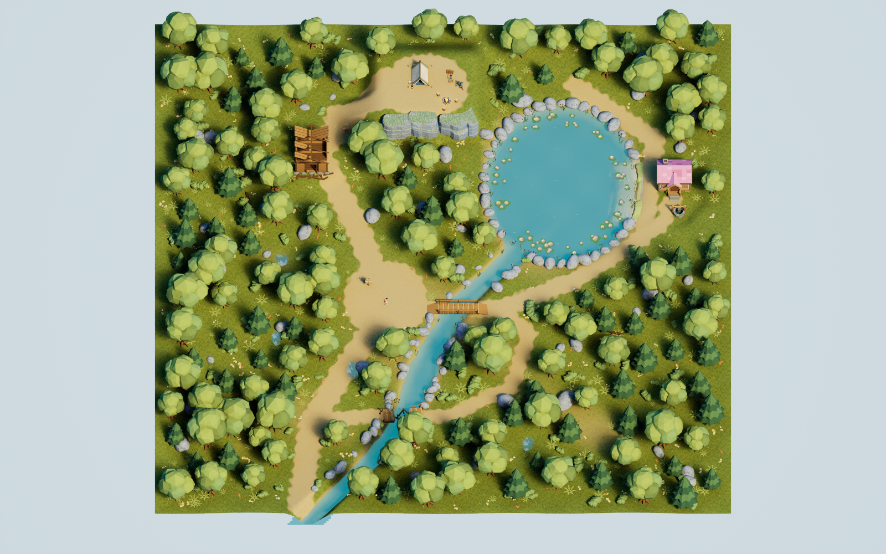
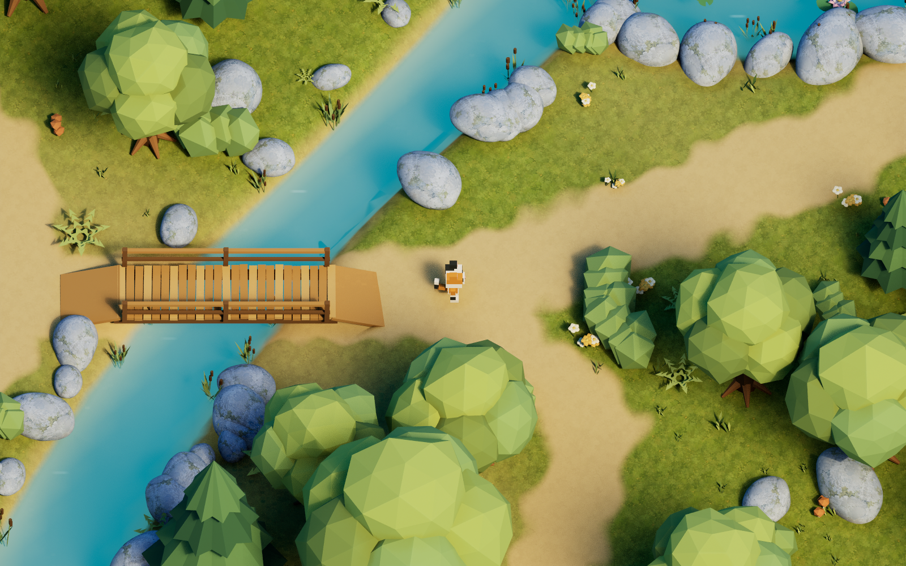
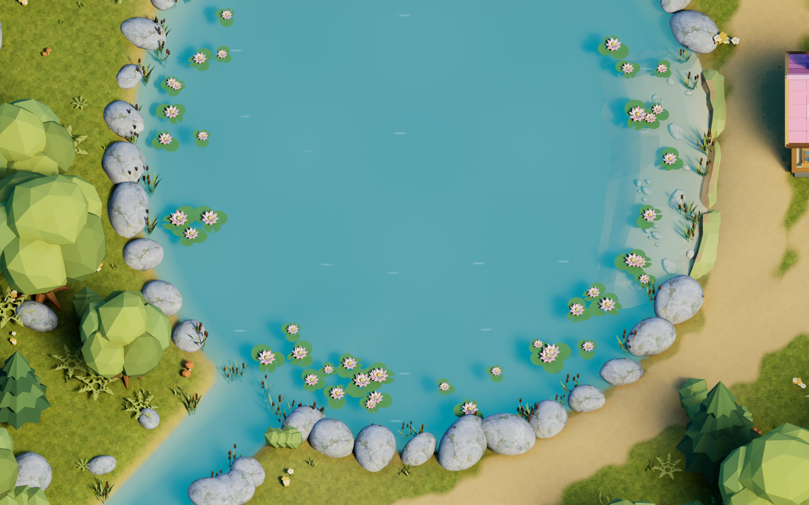
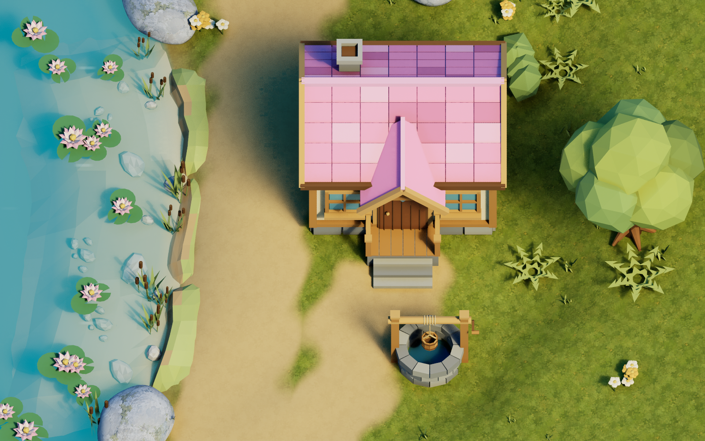
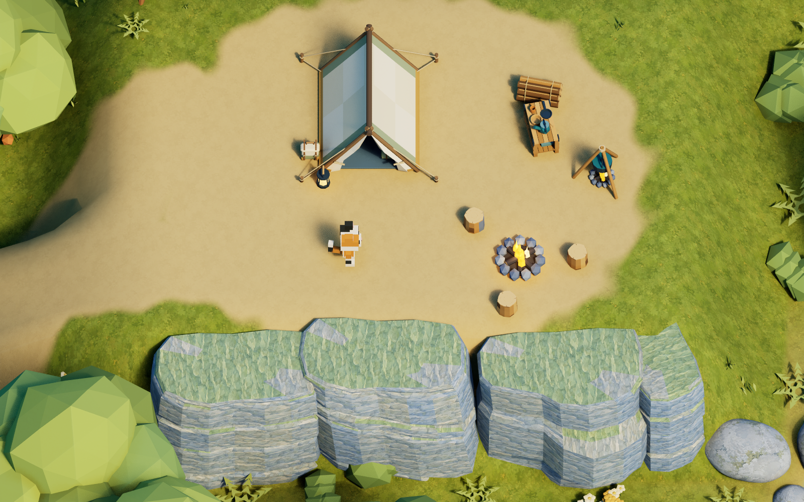
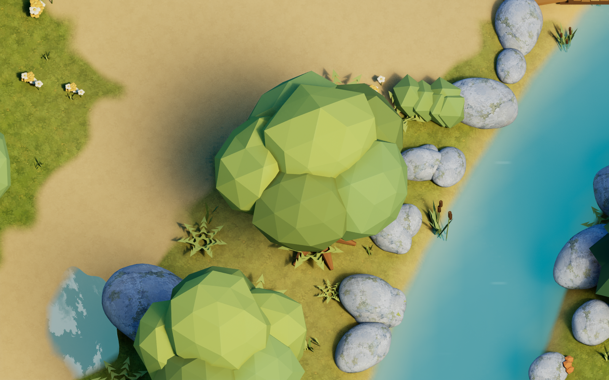

# AstraLevelTest

Unreal Engine 5.7.4 프로젝트. 약 100m 숲을 탐색하는 직립 보행 삼색 고양이 게임.

실제 언리얼 실행 화면. 숲과 공터를 중심으로 호수, 개울, 나무다리와 목조 폐허가 이어진다.

| 삼색 고양이와 나무다리 | 호수의 연꽃과 수초 |
| --- | --- |
|  |  |

## 조작

- WASD: 화면 기준 상하좌우 이동
- 카메라: 회전 없는 고정 58도 직교 시점, 캐릭터 추적
- 마우스 입력 없음

`AstraLevelTest.uproject`를 UE 5.7로 열고 기본 맵에서 Play를 누른다. 에디터가 키보드 입력을 받도록 플레이 뷰포커스가 필요하다. 재생 중에는 WASD만 사용한다.

## 작업 자료

- `WORK_INSTRUCTIONS.md`: 사용자의 전체 작업 지시
- `ArtSource/Reference`: 전체 및 개별 모델링 참고 이미지, 생성 프롬프트
- `ArtSource/Textures`: 생성한 지면·암벽·하늘 파노라마·물웅덩이 구름 텍스처
- `ArtSource/Blender/AstraWoodland.blend`: 모델과 전체 배치의 블렌더 원본
- `ArtSource/Meshes`: 블렌더에서 내보낸 FBX 모델
- `ArtSource/Layout/woodland_layout.json`: 블렌더에서 추출한 배치·재질·축변환 데이터
- `ArtSource/Layout/landscape_height.r16`: 실제 Landscape로 가져올 127×127 높이맵
- `ArtSource/Previews`: 블렌더 배치 렌더와 언리얼 검증 이미지

## 재생성

1. Blender 4.5 이상에서 `Scripts/build_blender_scene.py` 실행. 원본 `.blend`, FBX, JSON, 높이맵을 생성한다.
2. 숲 확장 원본은 `build_forest_cliffs.py`, `build_forest_tent.py`, `build_forest_signs.py`, `build_forest_cooking.py`로 각각 생성한다. 이어 `place_forest_expansion.py`를 Blender에서 실행해 절벽·야영지와 진입로 높이를 전체 배치에 합친다. 바위는 `build_smooth_forest_rocks.py`와 `apply_smooth_rocks_blender.py` 순서로 적용한다.
3. UE 5.7용 `AstraLevelTestEditor` 빌드.
4. **전체 언리얼 에디터**에서 `Scripts/import_unreal_scene.py` 실행. `-ExecutePythonScript=...`로도 실행할 수 있다. Content Browser를 사용하므로 UI 없는 Python commandlet로 텍스처 가져오기를 실행하지 않는다.
5. `Scripts/import_forest_expansion.py`로 숲 확장·해안 모듈·파노라마 하늘을 적용한다. 이 스크립트는 기존 Landscape와 맵을 보존하면서 갱신한다. 이후 `import_smooth_rocks.py`, `apply_forest_foliage.py` 순서로 바위와 작은 식물을 적용하고 `/Game/Astra/Maps/L_AstraWoodland`를 열어 Play한다.

레벨 생성 스크립트는 생성된 맵을 다시 작성한다. 수동 편집을 유지하려면 다른 이름으로 복사한 맵을 사용한다. 블렌더에서 수정한 배치를 전달할 때에는 동일한 JSON 구조를 유지한다.

블렌더 원본을 열고 직접 위치·회전·크기를 변경한 뒤에는 `Scripts/export_blender_layout.py`를 실행한다. 이 스크립트는 현재 배치를 그대로 추출하며 다시 흩뿌리지 않는다. 지형은 XY 격자를 유지하고 Z 높이만 수정하면 Landscape 높이맵으로 추출된다.

## 기술 메모

지형은 일반 스태틱 메시가 아닌 Unreal Landscape이다. 오브젝트는 Blender의 미터 단위 변환을 센티미터 단위로 바꿔 배치한다. 큰 구조물에는 삼각형 충돌, 나무에는 별도의 줄기 충돌을 사용한다. 작은 장식물은 이동을 막지 않는다.

Directional Light Source Angle은 사용자 지정값인 50도이며 Exponential Height Fog를 약하게 적용했다. 호수와 개울은 겹침 없는 하나의 수면 메시를 사용한다. 버텍스 경계 마스크와 DepthFade로 가장자리를 부드럽게 하고, 최신 아트 지시대로 구름 반사 없이 맑은 청록색과 수심 차이를 표현한다.

핑크 집의 현관은 게임 카메라 쪽인 UE −X를 바라보고 우물은 앞마당에 있다. `import_pink_house_scene.py`는 기존 맵을 `ArtSource/Backups`에 보관한 뒤 배치한다. 집터의 기존 식생 22개와 줄기 충돌은 `PreservedBeforePinkHouse` 폴더에 숨겨 보존했다. `refresh_house_terrain.py`는 기존 Landscape 편집 레이어에 높이를 갱신하고 집·우물·계단 앞의 충돌 높이를 검증한다.

`ReviewCameras`는 전체 배치·집·호수·야영지·절벽·이정표와 하늘 세 방향을 반복 촬영하기 위한 카메라다. 플레이 카메라는 고양이의 카메라 하나이며, 촬영 카메라들은 일반 플레이에서 선택되지 않는다.

게임 실행 인자 `-AstraSmokeTest`는 WASD 입력 이벤트를 순서대로 주입하고, 이동 방향·접지·카메라 회전 고정을 검사한다. `-AstraReview=Overview` 등의 검토 인자는 엔진 렌더를 저장하고 해당 검토 실행을 종료한다. 일반 플레이에는 이 동작이 없다.

`Scripts/render_reviews.ps1`로 Gameplay, Overview, Lake, Cabin, Puddle 렌더를 저장한다. `-AstraBridgeTest -AstraReview=Bridge`는 정상 다리 횡단을 검사한다. 실제 결과는 [VALIDATION.md](VALIDATION.md)에 기록했다.

## 독립 호숫가 메시 키트

얕은 모래 바닥 2종, 낮은 흙 턱 3종, 수중 돌·자갈 4종과 현장용 메시 4종을 제공한다. 집 앞 해안 12m 구간에 바닥·낮은 턱·수중 돌 16개를 적용했다. [메시 목록](ArtSource/Meshes/Shoreline/README.md)과 [통합 방법](Docs/ShorelineIntegration.md)을 참고한다.

## 절벽과 야영지

높이 8.035m의 절벽 3종은 층리와 기울기·돌출 형상을 달리했다. 아래가 막힌 긴 메시이므로 지면에 묻어 원하는 높이로 조립할 수 있다. **액터 Z = 원하는 절벽 상단 Z − 803.5cm × Z 스케일**로 맞춘다. 애니 배경풍 암벽 텍스처와 푸른 암부 색, 거친 표면을 적용했다.

숲 뒤편의 약 5.2m 높이 언덕에 절벽 4개를 조립하고 천막·침낭·가방·화톳불·취사 삼각대·조리대·랜턴·장작·통나무 의자를 배치했다. 중앙 공터와 야영지 입구에 호수·천막·집 그림이 있는 나무 이정표를 놓았다. 진입로는 Landscape 경사로이며 기존 길과 연결된다. 원본 식생 51개는 숨겨 보존하고 주변 25개는 변경된 지면 높이에 맞췄다.

`ArtSource/Layout/forest_expansion.json`은 배치 명세, `ForestCliffs.blend`, `ForestTent.blend`, `ForestSigns.blend`, `ForestCooking.blend`는 개별 모델 원본이다. `-AstraCampTest -AstraReview=Camp`는 캐릭터가 경사로를 오르는지 검사한다.

## 하늘

`T_AnimeSkyPanorama.png`는 별도 생성한 2:1 하늘 전용 파노라마다. `M_CloudSky`는 월드 방향을 경도·위도 UV로 변환하고 이음새와 극점을 부드럽게 합성한다. 호수·개울은 구름 반사 없이 유지하며, 작은 물웅덩이는 전용 구름 그림과 잔잔한 움직임을 이용한 착시 재질을 사용한다.

## 부드러운 바위와 Foliage

기존 숲 바위 5종은 각 1,920삼각형의 부드러운 노멀로 바꿨다. 삼각면마다 갈라진 색을 제거하고 ImageGen으로 생성한 `T_AnimeForestRockPaint.png`의 회청색 돌·푸른 균열·세이지 이끼를 적용했다. 기존 바위 155개의 위치·회전·크기와 UE 자산 참조는 유지한다.

작은 풀·고사리·꽃·버섯·갈대는 **실제 Unreal Foliage**로 묶었다. 기존 1,198개를 전환하고 숲 안쪽에 778개를 보강해 총 1,976개다. 길 가장자리 70cm, 공터, 집 앞, 야영지 동선과 급경사는 추가 배치에서 제외한다. 원래 개별 식물은 `PreservedBeforeFoliage`에 숨겨 보관한다.

`/Game/Astra/Foliage/FT_Astra_*`는 에디터 Foliage 모드에서도 편집할 수 있는 5개 FoliageType이다. [배치 규칙·재생성 방법](Docs/FoliagePlacement.md)과 `ArtSource/Layout/foliage_placement.json`에 설정과 전체 변환을 저장했다.
