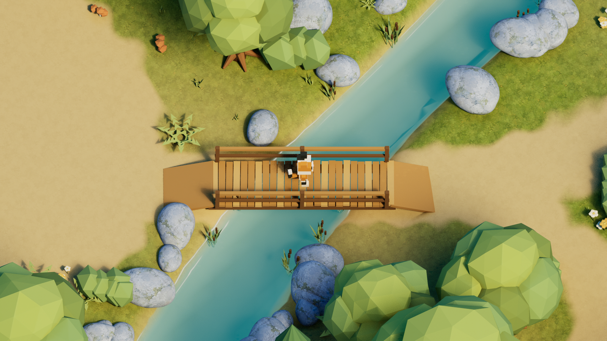
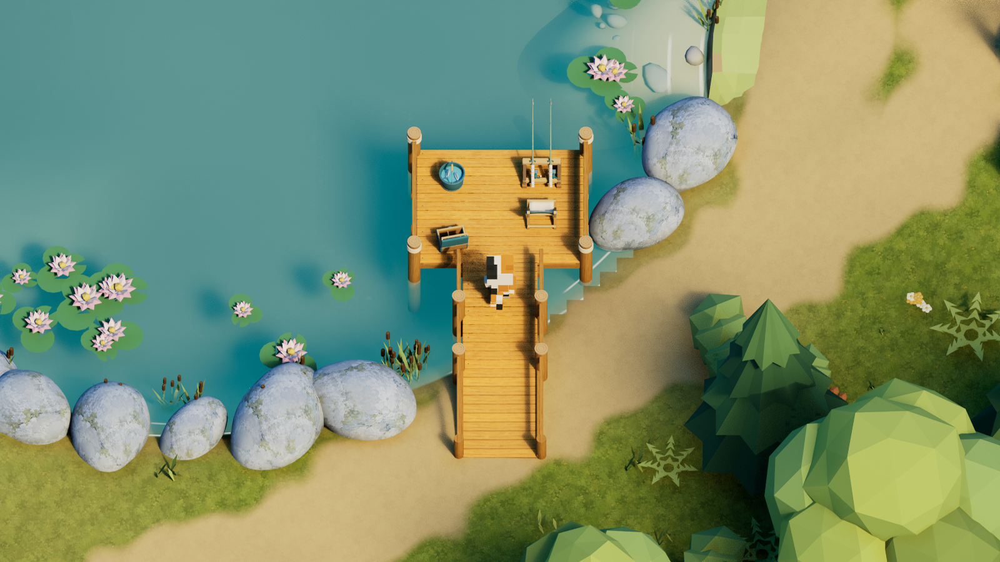
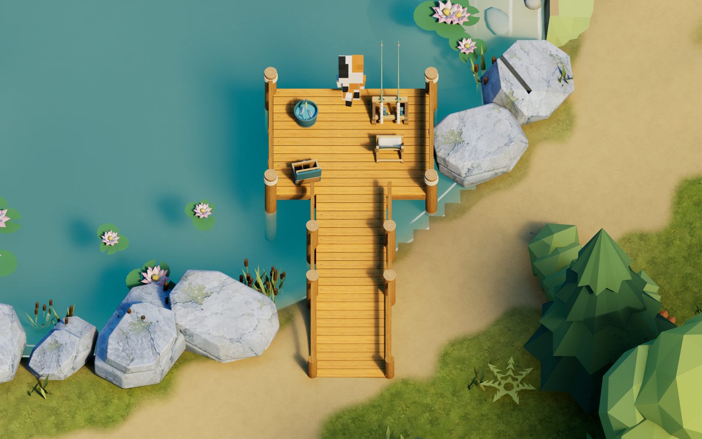
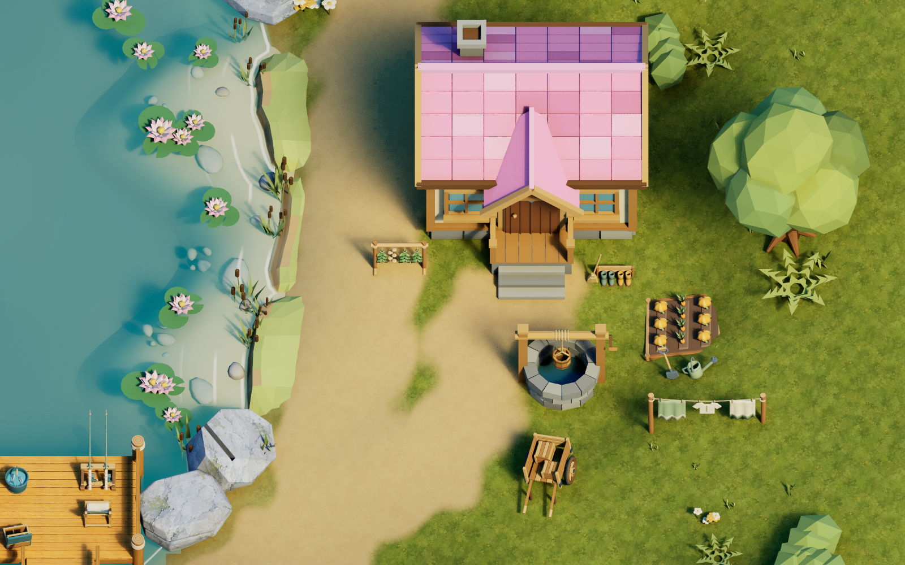
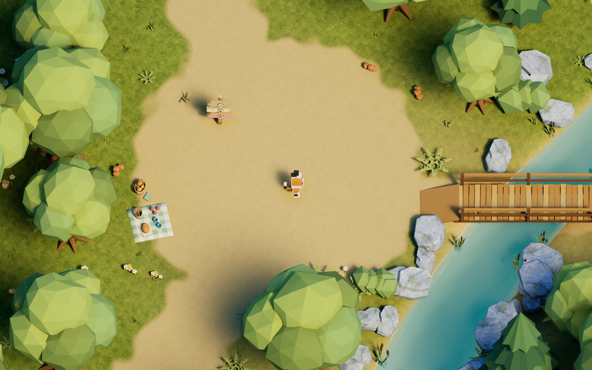
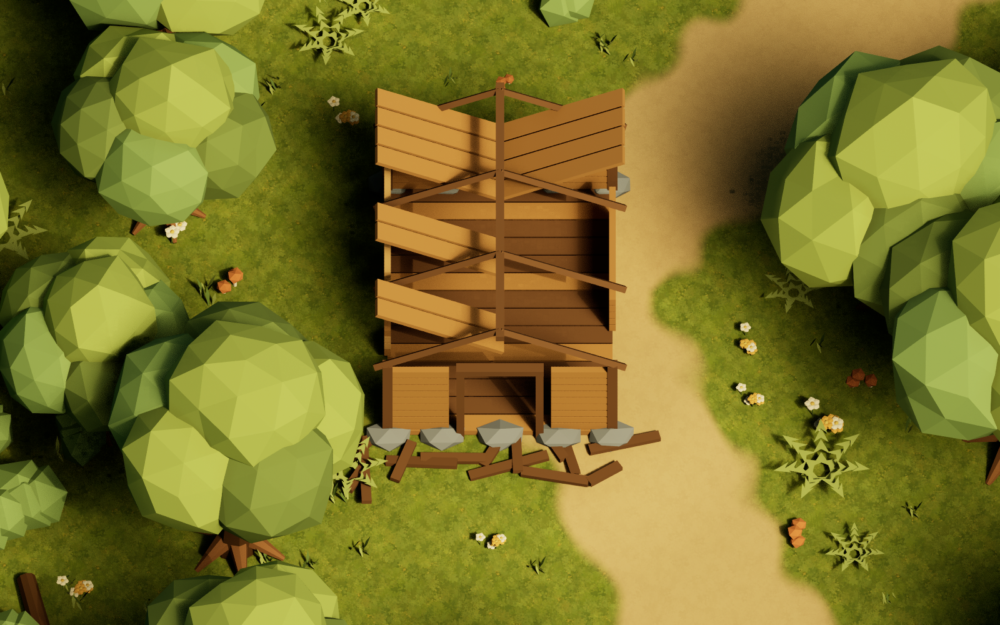

# AstraLevelTest 검증 기록

2026-09-07, Windows / Unreal Engine 5.7.4 / Blender 4.5.12 LTS.

## 구현 상태

- 실제 Unreal Landscape: 127×127 높이 샘플, 80cm 간격, 100.8×100.8m.
- 블렌더 원본에서 56개 사용 모델과 1,820개 배치 레코드를 추출했다. 별도 해안 키트·현장 메시 13개도 통합했다. 언리얼 맵에는 충돌 보조 액터와 조명·카메라, 보존한 식생을 포함해 2,108개 액터가 있다. 작은 식물 원본 1,198개는 숨겨 보존한다.
- 숲·공터·호수·개울·정상 다리·무너진 다리·목조 폐허, 연꽃·수초·풀·고사리·꽃·버섯·바위·쓰러진 통나무를 배치했다.
- Directional Light의 실제 저장값: Source Angle 50°, Intensity 6. 부드러운 그림자를 위해 Virtual Shadow Maps를 사용한다.
- 호수·개울은 하나의 연결 수면으로 통합해 반투명 메시가 겹치는 자국을 제거했다. 버텍스 마스크와 DepthFade로 가장자리를 부드럽게 한다. 최신 지시대로 구름 반사를 제외한 Unlit 청록색 수면이며 수심 차이와 작은 움직이는 반짝임을 표현한다.
- Exponential Height Fog 밀도 0.001, 최대 불투명도 0.06, 시작 거리 32m. 스카이 돔의 충돌 프로필을 NoCollision으로 저장해 플레이어 이동을 방해하지 않는다.
- 분홍 지붕 집과 우물을 화면 오른쪽 호숫가에 배치했다. 현관은 UE −X로 화면을 바라본다. 원본 맵을 백업하고 기존 식생은 숨겨 보존했다.
- 기존 Landscape 액터의 기본 편집 레이어에 집터 높이를 갱신했다. 집·우물·계단 앞의 실제 충돌 높이는 98.432cm이며 맵을 닫고 다시 연 뒤에도 동일하다.
- 박스형 삼색 고양이의 두 발·팔·꼬리를 절차적으로 움직인다. WASD만 이동에 사용하고 카메라는 회전하지 않는다.
- 숲 확장 메시 13종을 독립 Blender 원본에서 제작하고 18개를 배치했다. 높이 8.035m 절벽 3종을 조립하고, 5.2m 언덕 위에 천막·화톳불·취사 장비·장작·랜턴·의자를 놓았다. 이정표는 두 곳에 배치했다.
- Landscape 높이 샘플 793개를 갱신해 캠프 언덕과 10m 진입 경사로를 만들었다. 기존 액터를 유지했으며 기존 식생 51개는 숨겨 보관하고 주변 25개는 지형 높이에 맞췄다.
- 하늘을 별도 생성한 2:1 파노라마와 경도·위도 매핑으로 바꿨다. 구면 극점·이음새를 부드럽게 합성한다. 파란 이미지가 자동으로 노멀맵 판정을 받지 않도록 sRGB 색상 텍스처로 명시한다.
- 집 앞 해안 16개 액터를 실제 메인 맵에 통합했다. 웅덩이 5개에는 스카이·주변 환경을 반사하는 Thin Translucent 재질을 적용했다. F0 0.02의 네이티브 프레넬, Lumen front-layer reflection, 부드러운 경계와 거의 투명한 바닥 투과를 사용한다. 수면에 이미지 샘플이나 Emissive 출력은 연결하지 않는다.
- 숲 바위 5종을 넓은 암면·절리·층진 형상과 부드러운 모서리로 교체했다. 삼각형 수는 476 / 668 / 1,620 / 664 / 1,270개다. FBX custom normals와 기존 생성 텍스처를 사용하며 155개 기존 배치의 변환·자산 참조·재질 오버라이드를 유지했다.
- 수중 바위·자갈 4종은 형상·UV·재질 슬롯을 유지하면서 smooth normals로 바꿨다. 독립 FBX 재가져오기에서 노멀 최대 오차 0.030도 이내를 확인했다.
- 해안 1~7번 마감을 메인 맵에 적용했다. 실제 접촉선 57점을 따라 흰 포말·잔물결을 만들고 모래 바닥의 부드러운 노멀·외곽 색 연결·해안 형태 변화를 반영했다. 해안 바위 39개에는 현재 회청색 생성 텍스처를 보존한 젖은 재질을 덧씌웠고, 수중 돌 3개 재질의 기준색을 통일해 면별 색 차이도 제거했다.
- 네이티브 InstancedFoliageActor 1개와 FoliageType 5개로 작은 식물 1,963개를 유지한다. 최초 1,976개 중 생활 소품과 겹치는 13개(풀 4, 고사리 3, 꽃 2, 수초 4)만 제외했다. 남은 원본 전환분 1,189개와 추가분 774개의 위치·회전·크기를 유지하며 이전 전체 배치는 백업했다.
- 낚시 데크 1종, 낚시 소품 4종, 집 주변 소품 5종, 숲 생활 소품 5종을 독립 Blender 키트에서 제작하고 실제 맵에 15개 배치했다. 데크는 수면 위 75cm 높이이며 낮은 경사로로 산책길과 연결된다. 낚싯대·의자·양동이·태클 상자는 중앙 보행 통로를 피한다.
- 빨래·텃밭·물뿌리개·삽·장화·빗자루·허브 건조대·손수레는 집 주변, 피크닉과 채집 바구니는 공터 가장자리, 도끼 그루터기는 캠프 장작 옆, 수리 판자·공구·밧줄은 무너진 다리 옆에 배치했다. 기존 오브젝트 18개는 숨겨 보관하고 Landscape 높이는 변경하지 않았다.
- 새 재질 52개와 생성 목재 텍스처를 가져왔다. 기존 모든 재질 파일은 적용 전후 SHA256이 동일하다. 호수 안전 경계 3개만 데크 아래로 낮추고 앞끝과 두 어깨 구간에 보이지 않는 충돌 가드 3개를 추가했다.

## 실행 검증

| 검사 | 결과 |
|---|---|
| AstraLevelTestEditor / Win64 / Development 빌드 | 성공 |
| 실제 에디터에서 텍스처·FBX·Landscape·맵 생성 및 저장 | 성공 |
| W/A/S/D 입력 이벤트 각각 주입 | 네 방향 모두 예상 방향으로 2m 이상 이동, 접지 유지 |
| 이동 중 카메라 회전 | Pitch −58°, Yaw 0° 유지, 직교 너비 3,000cm |
| 정상 나무다리 횡단 | 약 12.2m 이동, 개울 위에서 다리 충돌면에 지지됨 |
| 현재 블렌더 장면의 수동 배치 내보내기 | 1,820개 위치·자산·그룹·충돌 속성 유지, JSON과 높이맵 바이트 동일 |
| 집터 Landscape 저장·다시 열기 | 집·우물·계단 앞 충돌 높이 98.432cm 유지 |
| 야영지 경사로 보행 | 약 15.2m 이동, 약 4.05m 상승, 접지 유지 |
| 절리와 암면을 살린 바위 가져오기 | 5종 476 / 668 / 1,620 / 664 / 1,270삼각형, 원본 바운드·155개 배치 변환 유지, custom normals 가져오기 |
| Foliage와 생활 공간 조정 | 5개 타입, 1,963개 인스턴스 실측, 제외한 13개와 이전 전체 배치 보관 |
| 저장된 메인 맵 다시 열기 | 숲 소품·바위·Foliage 수와 NoCollision·스카이 sRGB 색상 설정 재검증 통과 |
| 해안 마감 메인 맵 통합 | 포말 그래프 21개 검사 통과, 캠프 18개 변환·Foliage 1,976개·Landscape 유지 |
| 낚시·생활 소품 FBX 재가져오기 | 15종 모두 크기·UV·노멀·재질 슬롯 확인, 데크 9,880삼각형·치수 오차 0m |
| 낚시 데크 W 보행 | 890.90cm 이동, 통로·플랫폼 지지 유지, 끝에서 2초간 정지, 카메라 회전 고정 |
| 생활 소품 저장 후 다시 열기 | 실제 맵에서 신규 배치·FBX 삼각형 수·재질 슬롯·노멀·숨긴 원본·Foliage 등 67개 검사 통과 |

기계 판독 결과: [WASD와 카메라](ArtSource/Previews/UE_MovementValidation.json), [다리 횡단](ArtSource/Previews/UE_BridgeValidation.json), [블렌더 배치 추출](ArtSource/Previews/Blender_ExportValidation.json).

숲 확장 검증: [야영지 오르막](ArtSource/Previews/UE_CampMovementValidation.json), [저장 후 다시 열기](ArtSource/Previews/UE_ForestReloadValidation.json), [현재 바위 형상·재질·배치 보존](ArtSource/Previews/UE_FracturedRocksValidation.json), [실제 Foliage 수](ArtSource/Previews/UE_FoliageValidation.json). 이전 1,920삼각형의 둥근 바위 검증은 `UE_SmoothRocksValidation.json`에 작업 이력으로 보관한다. Foliage 재질은 인스턴스 메시용 셰이더 사용 플래그를 명시적으로 저장한다.

낚시·생활 소품 검증: [UE 적용과 기존 재질 해시 비교](ArtSource/Previews/UE_LifePropsValidation.json), [독립 저장 맵 검증](ArtSource/Previews/UE_LifePropsReloadValidation.json), [실제 데크 보행](ArtSource/Previews/UE_DockMovementValidation.json), [데크 FBX 재가져오기](ArtSource/Previews/FishingDock_FBXValidation.json). `BeforeLifeProps`에는 원본 맵·Blender·지형·전체 식물 배치와 바뀐 액터의 이전 상태를 보관했다.

해안 마감의 [메인 맵 적용 실측](ArtSource/Previews/UE_ShorelinePolishMainValidation.json)과 [독립 모듈의 13초·18초 실제 물결 이동 검증](ArtSource/Previews/UE_ShorelinePolishValidation.json)을 구분해 저장한다. 정확한 접촉선은 집 앞 해안 구간에 작성했으며 다른 물가는 얕은 수심 기준을 사용한다. 수심 표현은 고정 58도 게임 카메라에 맞췄다.

[최종 렌더 기록](ArtSource/Previews/UE_FinalReviewValidation.json)은 실제 UE 게임 화면 22장의 PNG 해시·해상도, 게임 렌더 로그의 재질 컴파일/인스턴싱 사용 오류 여부, 이동 및 저장 후 검증 결과를 함께 보관한다. 바위 상세는 별도 에디터 GPU 화면 1장으로 촬영하고 해시·해상도·맵 보존 여부를 추가 검사한다. 생성 참고 이미지는 여기에 포함하지 않는다. 웅덩이는 메인 맵의 탑다운·낮은 시점 두 방향으로 촬영한다.

다리 입구의 초기 단차 문제는 블렌더 원본 경사로를 늘린 뒤 FBX를 다시 가져와 해결했다. 이 검증은 에디터 및 에디터의 게임 실행 모드에서 수행했다. 배포용 패키지는 이번 작업 범위에 포함하지 않았다.

## 바위 모델링 개선 — 2026-09-07

5종 모두 닫힌 메시이며 UV와 FBX custom normals를 검사했다. 4번 절리 바닥의 부동소수점 오차로 중복된 정점 두 쌍을 용접했고, UE 정점 비교 기준에서 제거되는 극소 삼각형이 없음을 확인했다. [FBX 왕복 검증](ArtSource/Previews/FracturedForestRocks_Validation.json)

Blender 전체 씬의 바위 데이터 160개(라이브러리 5개와 배치 155개)를 교체했다. 배치 기록 1,820개와 모든 변환, Landscape 높이맵은 그대로다. [Blender 배치 보존](ArtSource/Previews/Blender_FracturedRockPlacementValidation.json)

UE 기존 자산 5개만 재임포트했다. 재질 슬롯 3개를 보존하고 실제 단일 렌더 섹션에는 기존 바위 재질의 0번 슬롯을 사용한다. 155개 바위 참조 중 표시된 147개와 숨겨 보관한 8개의 상태, 전체 2,108개 액터의 변환·가시성·충돌·재질을 전후 비교해 동일함을 확인했다. 메인 맵 및 기존 재질·텍스처·Foliage 파일의 SHA256도 동일하다. 형상 외 원본 상태는 `ArtSource/Backups/BeforeFracturedRocks`에 보관한다.

## P 데모 영상 모드 — 2026-09-07

`AstraLevelTestEditor / Win64 / Development` 빌드 성공. 실제 UE 게임을 1600×900으로 실행하고 `-AstraDemoTest`에서 입력 이벤트를 주입해 검증했다. 테스트 전체는 월드 시간 79.459초, 실패 0, 프로세스 종료 코드 0이다. 7개 컷은 약 72초에 한 바퀴를 돌고 첫 컷으로 반복한다.

| 검사 | 결과 |
| --- | --- |
| P 진입과 P 키 유지·반복 이벤트 | 진입 성공, 키를 유지해도 재토글 없음 |
| 공터 / 다리 / 집 / 캠프 / 폐허 / 데크 / 무너진 다리 | 7개 경로 완료, 각 5.94~15.78m 실제 보행, 지지면을 잃은 시간 0초 |
| 마지막 컷 뒤 첫 컷 반복 | 성공 |
| P 종료 후 원래 위치·회전 | 오차 0cm / 0도 |
| 비기본 이동 속도·카메라 너비·오프셋·지연·이동 모드·속도·원래 ViewTarget 복원 | 모두 성공 |
| 재진입 직후 1초 이내 P 취소 | 성공, 원래 상태 복원 |
| 복귀 후 W/A/S/D 실제 입력 | 각 방향 3.23~3.38m 이동, 접지 유지 |
| 실제 컷별 렌더 | 7장 저장·시각 확인, 재질 컴파일 오류 없음 |

기계 판독 결과: [UE_DemoValidation.json](ArtSource/Previews/UE_DemoValidation.json). 재실행: `Scripts/validate_demo_playback.ps1`. [사용법·컷 구성·편집 위치](Docs/DemoPlayback.md). 에디터의 게임 실행으로 검증했으며 배포 패키지는 만들지 않았다.

| 다리 횡단 컷 | 낚시 데크 컷 |
| --- | --- |
|  |  |

## 보관 자료

생성 이미지 27장(전체 참고 2장, 개별 모델 참고 19장, 텍스처 6장)을 원본 PNG로 보관했다. [레퍼런스 목록](ArtSource/Reference/README.md)과 각 생성 프롬프트를 함께 저장했다.

아래 이미지는 생성 참고 이미지가 아닌 실제 언리얼 엔진 렌더다.

