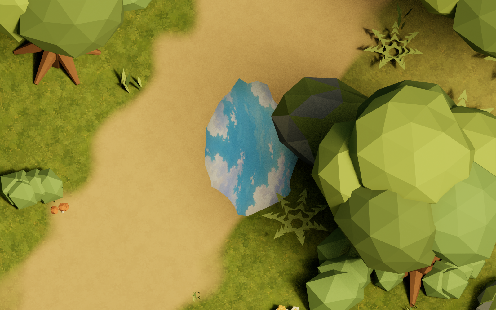

# AstraLevelTest 검증 기록

2026-09-07, Windows / Unreal Engine 5.7.4 / Blender 4.5.12 LTS.

## 구현 상태

- 실제 Unreal Landscape: 127×127 높이 샘플, 80cm 간격, 100.8×100.8m.
- 블렌더 원본에서 26개 FBX 모델과 1,807개 배치 레코드를 추출했다. 언리얼 맵에는 충돌 보조 액터와 조명·카메라를 포함해 2,032개 액터가 있다.
- 숲·공터·호수·개울·정상 다리·무너진 다리·목조 폐허, 연꽃·수초·풀·고사리·꽃·버섯·바위·쓰러진 통나무를 배치했다.
- Directional Light의 실제 저장값: Source Angle 50°, Intensity 6. 부드러운 그림자를 위해 Virtual Shadow Maps를 사용한다.
- 물웅덩이는 생성한 애니 배경풍 하늘 텍스처에 약한 UV 물결을 적용한다. 고정 시점용 가상 반사다.
- 박스형 삼색 고양이의 두 발·팔·꼬리를 절차적으로 움직인다. WASD만 이동에 사용하고 카메라는 회전하지 않는다.

## 실행 검증

| 검사 | 결과 |
|---|---|
| AstraLevelTestEditor / Win64 / Development 빌드 | 성공 |
| 실제 에디터에서 텍스처·FBX·Landscape·맵 생성 및 저장 | 성공 |
| W/A/S/D 입력 이벤트 각각 주입 | 네 방향 모두 예상 방향으로 3.4m 이상 이동, 접지 유지 |
| 이동 중 카메라 회전 | Pitch −58°, Yaw 0° 유지, 직교 너비 3,000cm |
| 정상 나무다리 횡단 | 약 12.2m 이동, 개울 위에서 다리 충돌면에 지지됨 |
| 현재 블렌더 장면의 수동 배치 내보내기 | 1,807개 위치·자산·그룹·충돌 속성 유지, JSON과 높이맵 바이트 동일 |
| 실제 게임 렌더 검토 | Gameplay, Overview, Lake, Cabin, Puddle, Bridge 저장 |

기계 판독 결과: [WASD와 카메라](ArtSource/Previews/UE_MovementValidation.json), [다리 횡단](ArtSource/Previews/UE_BridgeValidation.json), [블렌더 배치 추출](ArtSource/Previews/Blender_ExportValidation.json).

다리 입구의 초기 단차 문제는 블렌더 원본 경사로를 늘린 뒤 FBX를 다시 가져와 해결했다. 이 검증은 에디터 및 에디터의 게임 실행 모드에서 수행했다. 배포용 패키지는 이번 작업 범위에 포함하지 않았다.

## 보관 자료

생성 이미지 13장(전체 참고 2장, 개별 모델 참고 9장, 텍스처 2장)을 원본 PNG로 보관했다. [레퍼런스 목록](ArtSource/Reference/README.md)과 [생성 프롬프트](ArtSource/Reference/GENERATION_PROMPTS.md)를 함께 저장했다.

아래 이미지는 생성 참고 이미지가 아닌 실제 언리얼 엔진 렌더다.

