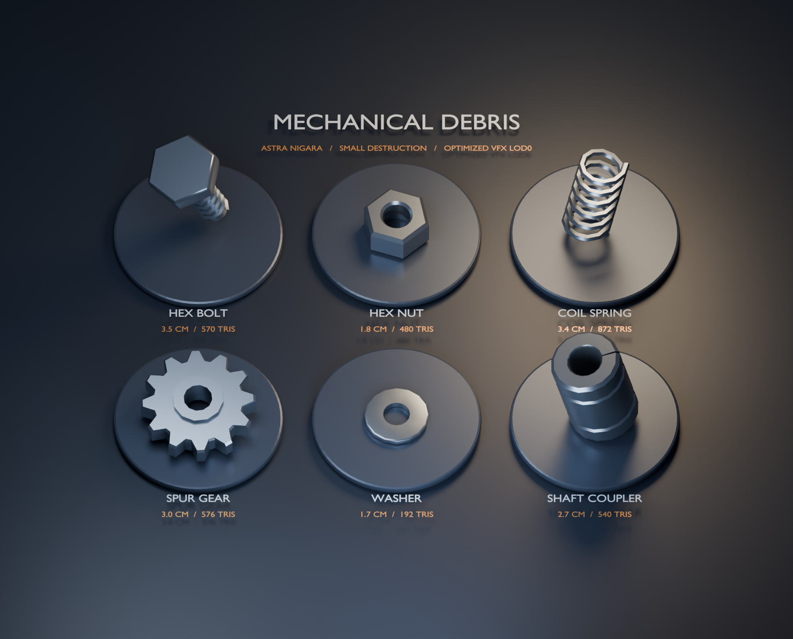
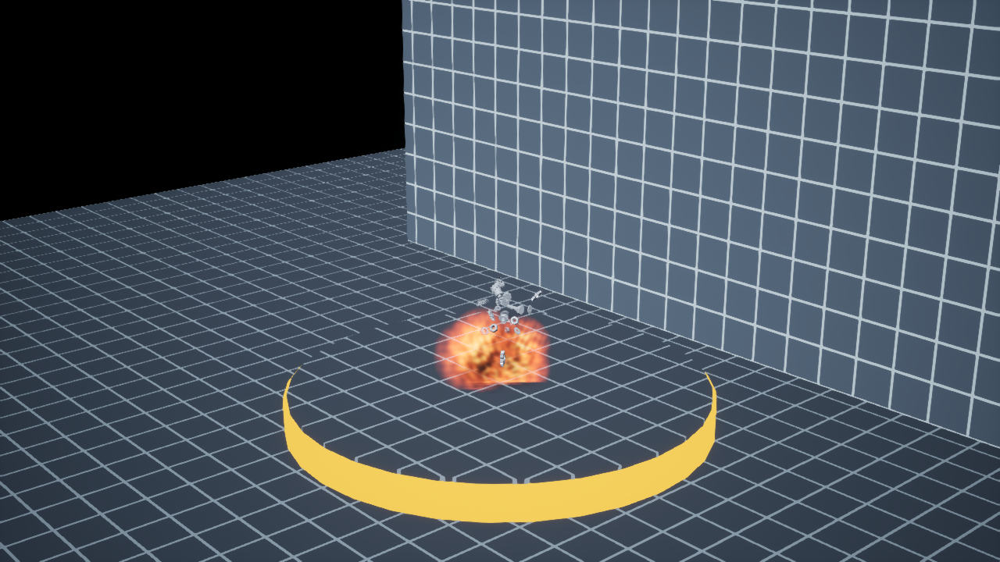
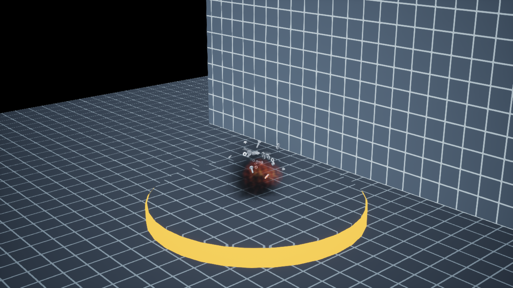
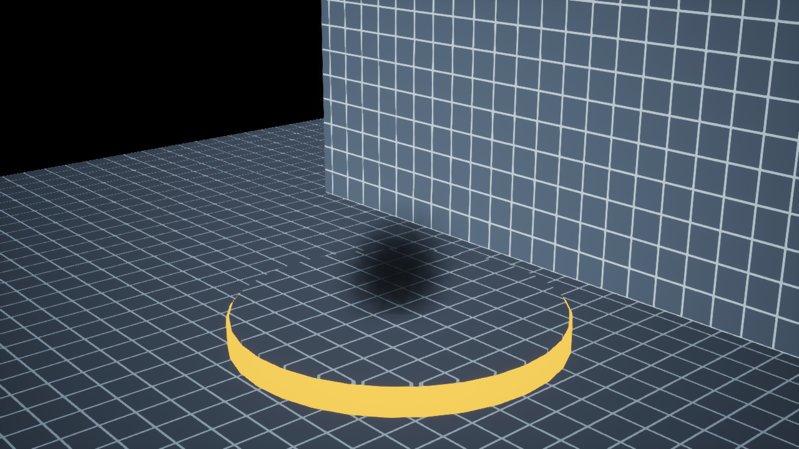

# Small destruction

UE 5.7, 1 Unreal unit = 1cm. The one-shot asset is `/Game/VFX/SmallDestruction/NS_SmallDestruction`; its presentation variant loops every 2 seconds. Both contain four editable Lightweight Niagara emitters.

| Emitter | Burst | Lifetime | Appearance |
| --- | ---: | --- | --- |
| Debris | 22 | 0.36–0.46s | Six mechanical meshes selected per particle: bolt, nut, spring, gear, washer and shaft coupler; uniform 0.8–1.2 scale, random orientation, angular velocity and gravity |
| Flame | 9 | 0.16–0.28s | Soft procedural orange/yellow additive burst, shrinking and fading |
| Smoke | 11 at 0.045s | 0.75–1.05s | Dark translucent puffs, rising, growing and fading |
| Distortion | 2 | 0.20–0.32s | Actual 2D-offset refraction, radial distortion fading with particle alpha |

The particles' configured movement and sizes keep this preset within a sub-meter region at actor scale 1.0. Fixed bounds are ±49cm on every axis; bounds alone are culling metadata and do not physically constrain particles. The showcase's gold rim is 100cm in diameter; the floor and backdrop grid spacing is 10cm. The floor lines also make heat refraction easier to inspect.

This is a visual effect preset. Debris uses short ballistic motion and has no collision, bounce, damage, or Chaos geometry fracture. Re-scaling the actor or editing spawn size/velocity can exceed the intended scale. Materials use procedural expressions, so no external image downloads are required.

The [mechanical part kit](../ArtSource/MechanicalParts/README.md) contains centimeter-scale static meshes under `/Game/VFX/SmallDestruction/Meshes`, with Blender source and individual FBX exports. The renderer's `Particles.MeshIndex` selects indices 0–5 with equal weights. A single steel material is assigned both to the assets and the Niagara renderer. Source dimensions are checked against the imported Unreal bounds before systems are rebuilt.

Each mesh has three LODs. The source kit totals 3,230 triangles across its six LOD0 meshes (58.2% below the initial 7,724). Unreal generates LOD1 at a 50% triangle target and LOD2 at 20%, with screen-size thresholds 0.025 and 0.008. Each Niagara mesh slot uses `ComponentOrigin` LOD selection, rather than the engine default of a fixed LOD0. Selection uses each mesh's size at the effect origin and the camera projection; particles using the same mesh share its selected LOD. Exact switch distances therefore depend on mesh size and camera FOV. This avoids basing tiny part LODs on the much larger effect bounds.

The one-shot's visible particles finish by approximately 1.095 seconds and its Niagara system completes at approximately 2 seconds. The looping variant starts a new burst every 2 seconds.

`AstraNigaraTools` is an editor-only authoring module. It clones the engine's FountainLightweight system, replaces its emitters/renderers, writes explicit spawn/distribution values, and compiles Niagara. `Scripts/build_small_destruction.py` creates the materials and map; it does not rebuild the original fountain map.

The status bridge runs locally inside Unreal. `check_editor.ps1 -Screenshot -NiagaraAgeSeconds 0.15` temporarily seeks editor-world Niagara components to that age, captures the rendered viewport, then restores their update modes. This captures the viewport rather than Windows editor panels. Use 0.15 seconds for the initial burst and 0.6 seconds for smoke. Generated reports and captures are stored under `Saved/`, which is ignored by Git.

Validated with UE 5.7.4: the editor module builds, both saved systems report `valid` and `ready_to_run`, and the reloaded map references the looping system. `Scripts/validate_small_destruction.py` also checks all four emitter names, burst settings, loop behavior, mesh/material references and refraction mode. The live editor reports its current map, active Niagara component and fresh heartbeat through `Scripts/check_editor.ps1`.

Real Unreal viewport captures (1280×720), with matching [validation evidence](Previews/Validation.json):

Initial burst at 0.15 seconds:

Mechanical fragments at 0.2 seconds:

Smoke at 0.6 seconds:

