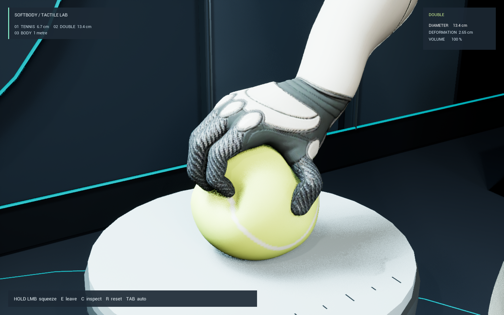
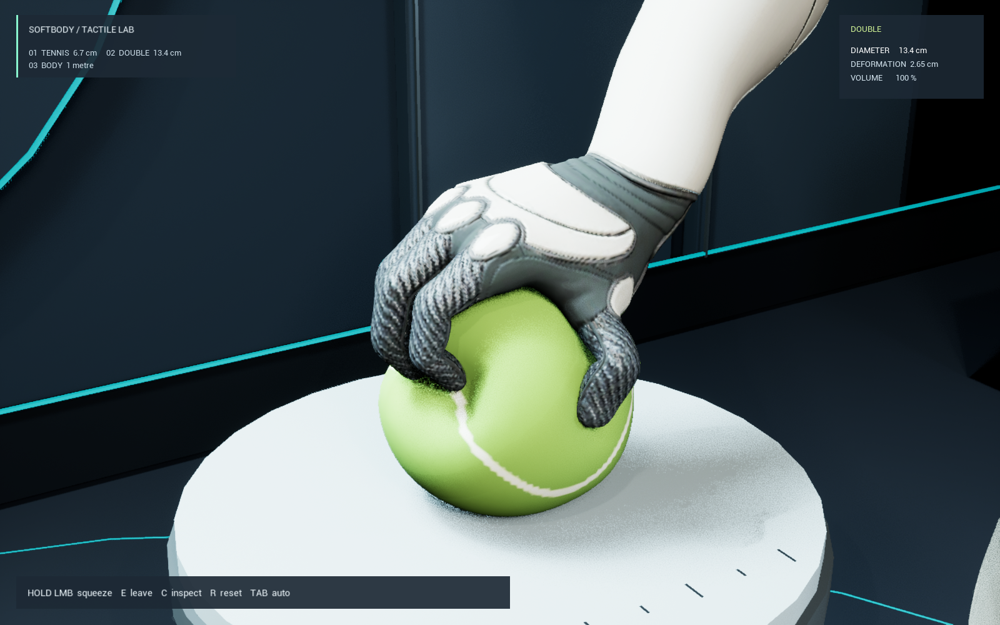

# 공 표면 명암 보정

2026-09-26, `M_Ball` 재질에 적용.

- 테니스공의 선형 바탕색을 `(0.59, 0.83, 0.045)`에서 약 `(0.195, 0.398, 0.018)`로 낮췄다.
- `TennisTint = (0.33, 0.48, 0.40)`. 기존 정점색의 황록색 영역에만 적용한다. 흰 솔기와 대형 공의 청록색은 원래 바탕색을 쓴다.
- Roughness: `0.55 → 0.78`. Specular: 기본 `0.5 → 0.18`.
- 노출은 기존 `-2.8 EV`를 유지한다. 저장된 레벨과 조명은 수정하지 않았다.

같은 카메라·동작으로 엔진에서 렌더링해 손가락이 누르는 부분의 음영과 공 앞면의 곡면을 확인했다. 재질 컴파일 오류 0건, 접촉·복원·대형 공 이동 검증 통과. 수치는 `Validation.json`과 `AppearanceUpdate.json`에 있다.

| 보정 전 | 보정 후 |
|---|---|
|  |  |

재적용: `Scripts/run.ps1 -Mode Appearance`. 에디터에 이전 재질이 로드되어 있으면 프로젝트를 다시 열어 최신 에셋을 불러온다.
